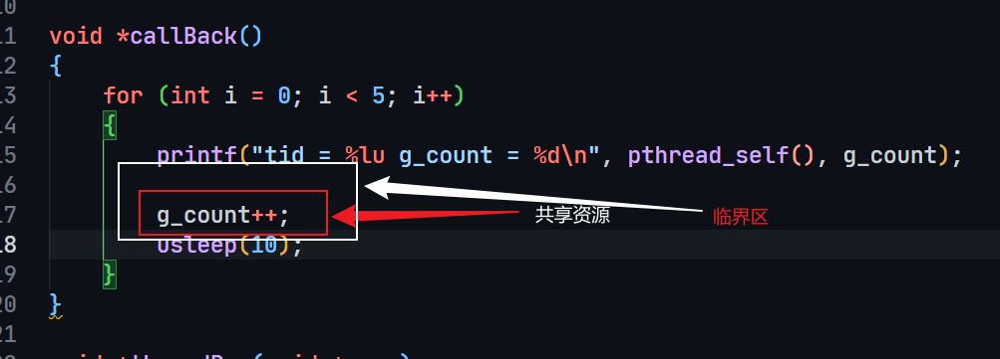

# 1. 线程同步概述
## 1.1 线程同步的目的
* 在多个线程同时访问共享资源时，为了保证数据的正确性，需要对多个线程访问共享资源的代码进行同步。
* 当有一个线程在对共享资源(又称**临界区**(如全局变量, 静态变量, 堆内存))进行操作时, 其他线程都不可以对这个共享资源进行操作, 处于**阻塞状态**, 直到该线程完成操作, 其他线程才能对该内存地址进行操作.
  
* 下面是一个没有进行线程同步的例子:
```cpp
// 临界区, 共享资源g_count
int g_count = 0;

void *callBack()
{
    for (int i = 0; i < 5; i++)
    {
        printf("tid = %lu g_count = %d\n", pthread_self(), g_count);

        // 访问共享资源, 未进行线程同步
        g_count++;
        usleep(10);
    }
}

void *threadRun(void *args)
{
    callBack();

    return NULL;
}

int main(int argc, char const *argv[])
{

    pthread_t tid[5];
    int i = 0;
    for (i = 0; i < 5; i++)
    {
        // 创建十个线程
        pthread_create(&tid[i], NULL, threadRun, NULL);
    }

    for(i = 0; i < 5; i++)
    {
        pthread_join(tid[i], NULL);
    }

    return 0;
}
```
> 输出结果:
```shell
tid = 140566671345216 g_count = 0
tid = 140566662952512 g_count = 0
tid = 140566654559808 g_count = 0
tid = 140566646167104 g_count = 0
tid = 140566662952512 g_count = 3
tid = 140566637774400 g_count = 0
tid = 140566671345216 g_count = 2
tid = 140566654559808 g_count = 5
tid = 140566671345216 g_count = 7
tid = 140566646167104 g_count = 5
tid = 140566654559808 g_count = 10
tid = 140566671345216 g_count = 10
tid = 140566662952512 g_count = 5
tid = 140566637774400 g_count = 7
tid = 140566646167104 g_count = 12
tid = 140566654559808 g_count = 13
tid = 140566646167104 g_count = 16
tid = 140566654559808 g_count = 17
tid = 140566646167104 g_count = 17
tid = 140566671345216 g_count = 13
tid = 140566662952512 g_count = 14
tid = 140566637774400 g_count = 15
tid = 140566662952512 g_count = 22
tid = 140566637774400 g_count = 22
tid = 140566637774400 g_count = 24
```
> 可见, 临界区的数据被多个线程同时访问, 造成了数据的不一致性.


## 1.2 实现线程同步的方法

* 实现线程同步的方法, 归根结底就是对临界区进行加锁, **保证同一时间只有一个线程可以访问临界区**.
* 具体的实现方法有四种:
  1. 互斥锁(mutex)
  2. 读写锁(rwlock)
  3. 条件变量(condition)
  4. 信号量(semaphore)

# 2. 互斥锁(mutex)
* 互斥锁是一种常用的线程同步机制, 用于保护临界区, 使得在同一时刻只有一个线程可以访问临界区.
* 互斥锁有两种状态: 锁定和未锁定. 互斥锁初始时是未锁定状态. 当一个线程对互斥锁加锁成功后, 该互斥锁变为锁定状态, 此时其他线程试图对该互斥锁加锁时, 将会阻塞, 直到该互斥锁被解锁. 互斥锁的解锁操作会使得互斥锁变为未锁定状态, 此时其他线程可以对该互斥锁加锁.
> 优点: 使用简单, 保护临界区的代码少, 保护效率高.
> 缺点: 1. 重复锁定和解锁, 每次都会检查共享数据结构, 会造成性能损失. 2. 在频繁加锁和解锁的情况下, 会造成线程饥饿, 使得其他线程无法获得锁, 从而无法执行. 3. 频繁查询的状态下, 会造成线程的上下文切换, 从而影响性能.

## 2.1 互斥锁函数
* 互斥锁类型: `pthread_mutex_t`
  > 一般情况下, **每一个共享资源对应一把锁**, 保证每个共享资源的访问都是互斥的, 锁的个数与线程的个数无关.
* 初始化和释放互斥锁:
    ```cpp
    // 初始化互斥锁
    // restrict: 是一个关键字, 用来修饰指针
    // 只有这个关键字修饰的指针可以访问指向的内存地址, 其他指针是不行的
    int pthread_mutex_init(pthread_mutex_t *restrict mutex,
            const pthread_mutexattr_t *restrict attr);
    // 释放互斥锁资源            
    int pthread_mutex_destroy(pthread_mutex_t *mutex);
    ```
  > **参数说明**:
  > * mutex: 互斥锁变量的地址
  > * attr: 互斥锁属性, 一般设置为NULL, 使用默认属性

* 加锁和解锁互斥锁:
    ```cpp
    // 加锁
    int pthread_mutex_lock(pthread_mutex_t *mutex);
    // 解锁
    int pthread_mutex_unlock(pthread_mutex_t *mutex);
    ```
    > **参数说明**:
    > * mutex: 互斥锁变量的地址
    > * 返回值: 0表示成功, 非0表示失败
    > 函数调用时, 首先检查互斥锁的状态, 如果是未锁定状态, 则将互斥锁的状态设置为锁定状态, 并返回. 如果是锁定状态, 则阻塞等待, 直到互斥锁的状态变为未锁定状态, 然后将互斥锁的状态设置为锁定状态, 并返回. 解锁时, 将互斥锁的状态设置为未锁定状态.

* 尝试加锁:
  ```cpp
    // 尝试加锁
    int pthread_mutex_trylock(pthread_mutex_t *mutex);
  ```
    > **参数说明**:
    > * mutex: 互斥锁变量的地址
    > 调用这个函数时, 首先检查互斥锁的状态, 如果是未锁定状态, 则将互斥锁的状态设置为锁定状态, 并返回. 如果是锁定状态, 则立即返回错误号, 不会阻塞等待.

* 使用互斥锁修改一开始的例子程序:
  ```cpp
    // 多个线程共享的全局变量
    int g_count = 0;

    // 对应的互斥锁
    pthread_mutex_t g_mutex;

    void *callBack()
    {
        for (int i = 0; i < 5; i++)
        {
            // 加锁
            pthread_mutex_lock(&g_mutex);
            printf("tid = %lu g_count = %d\n", pthread_self(), g_count);

            g_count++;
            // 解锁
            pthread_mutex_unlock(&g_mutex);
            usleep(10);
        }
    }

    void *threadRun(void *args)
    {
        callBack();

        return NULL;
    }

    int main(int argc, char const *argv[])
    {

        pthread_t tid[10];
        pthread_mutex_init(&g_mutex, NULL);
        int i = 0;
        for (i = 0; i < 5; i++)
        {
            pthread_create(&tid[i], NULL, threadRun, NULL);
        }

        for (i = 0; i < 5; i++)
        {
            pthread_join(tid[i], NULL);
        }

        return 0;
    }
    ```

# 3. 读写锁(rwlock)
* 读写锁也称之为**共享-独占锁**, 一般用于读操作大于写操作的场合.
* 互斥锁是独占锁, 对于共享资源的访问是独占的, 而读写锁是共享-独占锁, 对于共享资源的访问是共享的, 也就是说, 多个线程可以同时对共享资源进行读操作, 但是只能有一个线程对共享资源进行写操作.
* 读写锁的状态有四种: 读锁定, 写锁定, 读锁定和写锁定, 未锁定.
* 读写锁的两种常见策略:
  1. 强读者同步
   * 总是给读者更高的优先级, 只要没有写操作, 读者就可以获取访问权, 比如图书馆查询系统.
  2. 强写者同步
   * 总是给写者更高的优先级, 读者只能等到写者结束后才能执行, 如订票系统, 要求看到最新的信息记录, 会使用强写者同步策略.

## 3.1 读写锁函数
* 读写锁类型: `pthread_rwlock_t rwlock;`
  > 一般情况下, 锁中记录了:
  > 1. 锁的状态: 锁定/打开
  > 2. 锁的类型: 读锁定/写锁定, **如果使用读写锁锁定了读操作, 需要先解锁才能锁定写操作, 反之亦然.**
  > 3. 锁的拥有者: 哪个线程拥有了这个锁
* 初始化和释放读写锁:
    ```cpp
    // 初始化读写锁
    int pthread_rwlock_init(pthread_rwlock_t *restrict rwlock,
            const pthread_rwlockattr_t *restrict attr);
    // 释放读写锁资源            
    int pthread_rwlock_destroy(pthread_rwlock_t *rwlock);
    ```
  > **参数说明**:
  > * rwlock: 读写锁变量的地址
  > * attr: 读写锁属性, 一般设置为NULL, 使用默认属性

* 加读锁:
    ```cpp
    // 加读锁
    int pthread_rwlock_rdlock(pthread_rwlock_t *rwlock);
    ```
    > **参数说明**:
    > * rwlock: 读写锁变量的地址
    > * 返回值: 0表示成功, 非0表示失败
    > 函数调用时, 首先检查读写锁的状态, 如果是未锁定状态, 则将读写锁的状态设置为读锁定状态, 并返回. 如果是读锁定状态, 则依然可以加锁成功, 因为读锁是共享的; 如果读写锁已经锁定了写操作, 则阻塞等待, 直到读写锁的状态变为未锁定状态, 然后将读写锁的状态设置为读锁定状态, 并返回. 解锁时, 将读写锁的状态设置为未锁定状态.

* 加写锁:
    ```cpp
    // 加写锁
    int pthread_rwlock_wrlock(pthread_rwlock_t *rwlock);
    ```
    > **参数说明**:
    > * rwlock: 读写锁变量的地址
    > * 返回值: 0表示成功, 非0表示失败
    > 函数调用时, 首先检查读写锁的状态, 如果是未锁定状态, 则将读写锁的状态设置为写锁定状态, 并返回. 如果读写锁已经锁定了读操作或者写操作, 调用这个函数的线程会被阻塞.

* 尝试加锁:
    ```cpp
    // 尝试加锁
    int pthread_rwlock_tryrdlock(pthread_rwlock_t *rwlock);
    int pthread_rwlock_trywrlock(pthread_rwlock_t *rwlock);
    ```
    > **参数说明**:
    > * rwlock: 读写锁变量的地址
    > * 返回值: 0表示成功, 非0表示失败
    > 调用这个函数时, 首先检查读写锁的状态, 如果是未锁定状态, 则将读写锁的状态设置为读锁定状态, 并返回. 如果是读锁定状态, 则依然可以加锁成功, 因为读锁是共享的; 如果读写锁已经锁定了写操作, 则立即返回错误号, 不会阻塞等待. 解锁时, 将读写锁的状态设置为未锁定状态.

* 解锁:
    ```cpp
    // 解锁
    int pthread_rwlock_unlock(pthread_rwlock_t *rwlock);
    ```
    > **参数说明**:
    > * rwlock: 读写锁变量的地址
    > * 返回值: 0表示成功, 非0表示失败


     