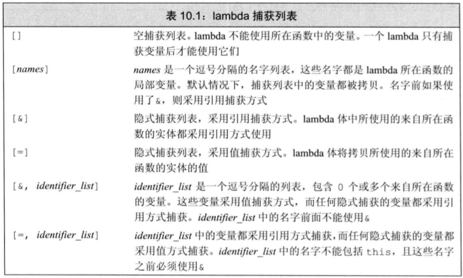
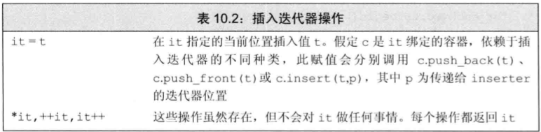
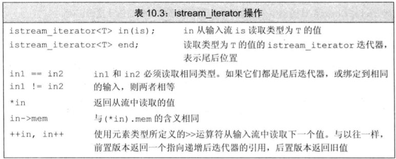
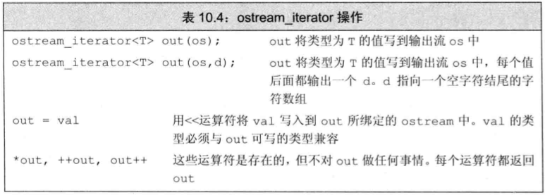
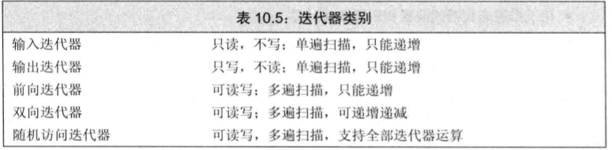
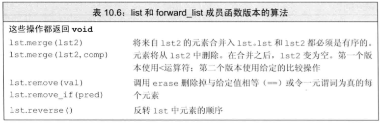
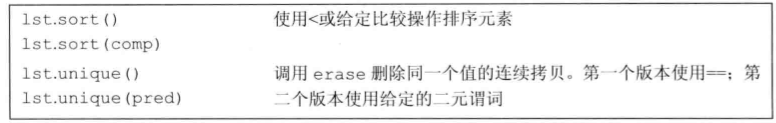
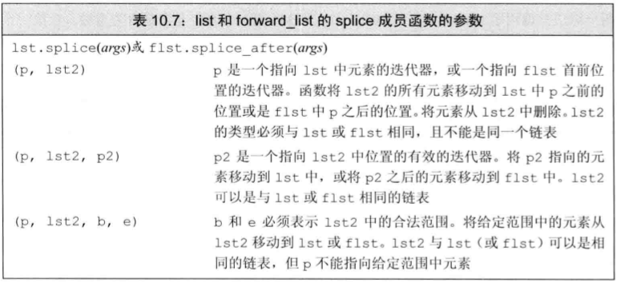

* **泛型算法**实现了一组经典算法的公共接口, 如排序和搜索。

# 10.1 概述
* 头文件`<algorithm>`定义了一组泛型算法, 标准库还在头文件`<numeric>`中定义了一组数值泛型算法。
* 通常情况下, 算法**并不直接操作容器**, 而是遍历由两个迭代器指定的一个元素范围进行操作.

# 10.2 泛型算法
## 10.2.1 只读算法
* 一些算法只读取序列中的元素, 而不会改变元素的值, 如`find`和`count`.
* `accumulate`定义在头文件`numeric`中, 它接受三个参数, 一个表示序列的迭代器, 一个表示序列中元素的初始值, 一个表示累加操作的二元函数.
  ```cpp
  int sum = accumulate(vec.cbegin(), vec.cend(), 0);
  string s = accumulate(vec.cbegin(), vec.cend(), string(""));
  ```
  > 第三个参数的类型决定了函数中使用哪个加法运算符(上例中分别为`int`和`string`)以及返回值的类型.

* 对于只读取而不改变元素的算法, 通常最好用`cbegin()`和`cend()`.
* `equal`也是一个只读算法, 用于确定两个序列是否保存相同的值.
  ```cpp
  bool b = equal(vec.cbegin(), vec.cend(), list.cbegin());
  ```
  > 只接受一个单一迭代器来表示第二个序列的算法, 都假定第二个序列至少与第一个序列一样长.

## 10.2.2 写容器算法
* 一些算法会改变它们所操作的序列, 在使用这类算法时, 需要**注意确保序列原大小至少不小于我们要求算法写入的元素数目**.
* `fill`接收一对迭代器表示一个范围, 还接受一个值作为第三个参数, fill会将给定值赋予给定范围内的每个元素.
  ```cpp
  fill(vec.begin(), vec.end(), 0);  // 将vec中的每个元素都赋值为0
  ```
  > file向给定输入序列中写入数据, 因此只要传递的输入序列有效, 那么写入操作就是安全的.

* **确保算法不会试图访问序列中不存在的元素是程序员的责任**.

* `fill_n`接受一个迭代器和一个计数值, 它会将给定值赋予给定范围内的元素.
  ```cpp
  fill_n(vec.begin(), vec.size(), 0);
  ```
  > `fill_n`不会检查给定的计数值是否大于序列的大小, 因此使用`fill_n`时, 应该确保计数值不大于序列的大小.
  > 向目的位置迭代器写入数据的算法假定目的位置足够大, 能容纳要写入的元素.

* 可以使用**插入迭代器**来保证算法有足够元素控件来容纳输出数据.
* `back_inserter`接受一个容器作为参数, 返回一个插入迭代器, 该迭代器调用容器的`push_back`成员.
  ```cpp
  vector<int> vec;
  fill_n(back_inserter(vec), 10, 0);
  ````
  > 在每步迭代中, fill_n想给定序列的一个元素赋值, 由于传递的参数是back_inserter返回的迭代器, 因此每次赋值都会在vec上调用push_back, 最终fill_n调用语句想vec的末尾添加了10个值为0的元素.

* **拷贝(copy)**算法想目的位置迭代器指向的输出序列中的元素写入数据.
* **传递给copy的目的序列至少要包含与输入序列一样多的元素**
  ```cpp
  int a1[] = {0, 1, 2, 3, 4, 5, 6, 7, 8, 9};
  int a2[sizeof(a1) / sizeof(*a1)]; // a2大小与a1一样
  // ret指向拷贝到a2的尾元素之后的位置.
  auto ret = copy(begin(a1), end(a1), a2);
  ```

* `replace`算法读入一个序列, 将其中所有等于给定值的元素都改为另一个值.
  ```cpp
  // 将所有值为0的元素改为42
  replace(ilst.begin(), ilst.end(), 0, 42);
  ```

* `replace_copy`接收额外第三个迭代器参数, 指出调整后序列的保存位置.
  ```cpp
  // 使用back_inserter按需要增长目标序列
  replace_copy(ilst.cbegin(), ilst.cend(), back_inserter(ivec), 0, 42);
  ```
  > 调用后, ilst并未改变, ivec包含ilst的一份拷贝, 不过原来在ilst中值为0的元素在ivec中都变为42.

## 10.2.3 重排容器元素的算法
* `sort`会重排输入序列中的元素, 使之有序.
* `unique`会重排容器中的元素, 使得不重复的元素出现在容器的开始部分.
  ```cpp
  // 删除序列中的重复的单词
  void elimDups(vector<string> &words)
  {
    // 按字典顺序排序words
    sort(words.begin(), words.end());
    // 使单词只出现一次
    // 排列在范围的前部, 返回指向不重复区域之后一个位置的迭代器.
    auto end_unique = unique(words.begin(), words.end());
    // 由于算法不能执行容器的操作, 使用容器的成员来完成真正的删除操作
    words.erase(end_unique, words.end());
  }
  ```
  > unique重排序列, 将重复的元素放在最后面, 不进行排序操作.

*** 

# 10.3 定制操作
* 以排序算法`sort`为例, 对于上例elimDups, 假定希望单词以其长度排序, 大小相同的再按字典序排序, 则需要使用sort的第二个版本, 其接受第三个参数: **谓词**.
* **谓词**是一个可调用的表达式, 其返回结果是一个能用作条件的值.
* 标准库中谓词分为两类: **一元谓词**和**二元谓词**, 区别在于接受参数的个数(分别为一个和两个);
  ```cpp
  // 比较函数, 用于按长度排序
  bool isShorter(const string &s1, const string &s2)
  {
    return s1.size() < s2.size();
  }
  // 按长度由短至长排序
  sort(words.begin(), words.end(), isShorter);
  ```

## 10.3.2 lambda表达式
* 可以向一个算法传递任何类别的**可调用对象**, 对于一个对象或一个表达式, 如果可以对其使用调用运算符, 则称它为可调用的.
* 函数和函数指针都是可调用对象, 另外两种为: 重载了调用运算符的类, 和**lambda表达式**.
* 一个lambda表达式表示一个可调用的代码单元, 即一个未命名的内联函数.
* 一个lambda表达式具有一个返回类型, 一个参数列表和一个函数体.
  ```cpp
  // lambda表达式的基本形式
  [capture list] (parameters) -> return type { function body }
  ```
  > 其中, `capture list`(捕获列表)是一个lambda所在函数中定义的局部变量的列表(通常为空), return type, parameter list和function body与其他普通函数一样, 分别表示返回类型, 参数列表和函数体. 与普通函数不同, lambda必须使用尾置返回来指定返回类型.

* **可以忽略参数列表和返回类型, 但必须永远包含捕获列表和函数体**.
  ```cpp
  auto f = [] { return 42; };
  cout << f() << end;  // 打印42
  ```

* **如果lambda的函数体包含任何单一return语句之外的内容, 且未指定返回类型, 则返回void.
* **lambda不能待遇默认参数**, 养个车lambda调用的实参数目永远与形参数目相等.
  ```cpp
  // 使用lambda实现isShorter
  sort(words.begin(), words.end(), [](const string &a, const string &b) { return a.size() < b.size(); });
  ```

* 一个lambda只有在其捕获列表中捕获一个它所在函数中的局部变量, 才能在函数体中使用该变量.
  ```cpp
  // 查找第一个长度大于等于sz的单词
  auto wc = find_if(words.begin(), words.end(), [sz](const string &a) { return a.size() >= sz; });
  ```
* `for_each`接受一个可调用对象, 并对容器中的每个元素调用该对象.
  ```cpp
  // 使用lambda表达式打印vector中的元素
  for_each(words.begin(), words.end(), [](const string &s) { cout << s << " "; });
  ```
  > 捕获列表只用于局部非static变量, lambda可以直接使用局部static变量和在它所在函数之外声明的名字.

```cpp
// 使用lambda表达式改写biggies
void biggies(vector<string> &words, vector<string>::size_type sz)
{
  elimDups(words);  // 将words按字典序排序, 删除重复单词
  // 按长度排序, 长度相同的单词维持字典序
  stable_sort(words.begin(), words.end(), [](const string &a, const string &b) { return a.size() < b.size(); });
  // 获取一个迭代器, 指向第一个满足size() >= sz的元素
  auto wc = find_if(words.begin(), words.end(), [sz](const string &a) { return a.size() >= sz; });
  // 计算满足size >= sz的元素的数目
  auto count = words.end() - wc;
  cout << count << " " << make_plural(count, "word", "s") << " of length " << sz << " or longer" << endl;
  // 打印长度大于等于给定值的单词, 每个单词后面接一个空格
  for_each(wc, words.end(), [](const string &s) { cout << s << " "; });
  cout << endl;
}
```

## 10.3.3 lambda捕获和返回
* 在定义一个lambda时, 编译器生成一个与lambda对应的新的**未命名**的类类型.
* 当使用auto定义一个用lambda初始化的变量时, 则定义了一个从lambda生成的类型的对象.
* lambda的捕获方式可以是值也可以是引用.
* **被捕获的变量的值是在lambda创建时拷贝, 而不是在调用时拷贝.**
  ```cpp
  void fcn1()
  {
    size_t v1 = 42;
    // ok: 捕获v1的值
    auto f = [v1] { return v1; };
    v1 = 0;
    auto j = f();  // j的值是42, f保存了v1的拷贝
  }

  void fcn2()
  {
    size_t v1 = 42;
    // ok: 捕获v1的引用
    auto f2 = [&v1] { return v1; };
    v1 = 0;
    auto j = f2();  // j的值是0, f2保存了v1的引用
  }
  ```

* 如果采用引用的方式捕获一个变量, 就**必须确保被引用的对象在lambda执行的时候是存在的.**
* 可以通过隐式捕获和显式捕获来指定lambda所捕获的变量.
* `&`表示采用引用方式捕获, `=`表示采用值方式捕获.
  ```cpp
  // 隐式捕获
  void fcn3()
  {
    size_t v1 = 42;
    auto f = [=] { return v1; };
    v1 = 0;
    auto j = f();  // j的值是42, f保存了v1的拷贝
  }

  // 显式捕获
  void fcn4()
  {
    size_t v1 = 42;
    size_t v2 = 33;
    // v1隐式捕获, v2显式捕获, 值捕获
    auto f2 = [&, v2] { return v1 + v2; };
    v1 = 0;
    auto j = f2();  // j的值是33, f2保存了v1的引用
  }
  ```

* 当混合使用隐式捕获和显示捕获时, 显示捕获的变量必须使用与隐式捕获不同的方式. 即, 如果隐式捕获采用引用方式, 则显示捕获的变量必须采用值方式捕获, 反之亦然.
  

* 对于return语句并不是单一的情况, 必须使用尾置返回类型.
  ```cpp
  // 返回lambda的返回类型是int
  auto f = [] (int i) -> int { if (i < 0) return -i; else return i; };
  ```

## 10.3.4 参数绑定
* `bind`函数可以将一个可调用的表达式绑定到一个或多个参数上.
* `bind`函数的第一个参数是一个可调用的表达式, 后面的参数是要绑定到可调用表达式的参数上的值.
* `bind`的一般形式: `auto newCallable = bind(callable, val1, val2, ..., valn);`
  > 在调用newCallable时, newCallable会将val1, val2, ..., valn绑定到callable的参数上, 然后调用callable.

* arg_list是一个参数列表, 其中的每个参数都是一个占位符, 用来表示要绑定的参数: _1为第一个参数, _2为第二个参数, 以此类推.

* find_if接受一元谓词, 无法使用函数作为参数传递, 下例为使用bind改写:
  ```cpp
  bool check_size(const string &s, string::size_type sz)
  {
    return s.size() >= sz;
  }

  // 原调用方法
  auto wc = find_if(words.begin(), words.end(), [sz] (const string &a) { return a.size() >= sz; });

  // 使用bind改写
  auto wc = find_if(words.begin(), words.end(), bind(check_size, _1, sz));
  ```
  > `bind`函数的第一个参数是一个可调用的表达式, 后面的参数是要绑定到可调用表达式的参数上的值. 因此, `bind(check_size, _1, sz)`的意思是将`_1`绑定到`check_size`的第一个参数上, 将`sz`绑定到`check_size`的第二个参数上.

* 在使用_1, _2, ...时, 需要进行声明, 否则会报错.
* _n定义在`std::placeholders`命名空间中, 因此需要进行声明.
  ```cpp
  // 声明
  using namespace std::placeholders;
  ```

* 假定f是一个可调用对象, 包含5个参数:
  ```cpp
  // g是一个有两个参数的可调用对象
  auto g = bind(f, _2, a, b, _1, c);
  ```
  > g的第一个参数绑定到f的第二个参数上, 第二个参数绑定到f的第五个参数上. 即参数可以重新排序.

* 如果希望传递给bind一个对象而又不拷贝它, 则需要使用标准库`ref`函数, 函数ref返回一个对象, 包含给定的引用, 此对象时可以拷贝的.
* 同时标准库包含常量版本`cref`.

***

# 10.4 再探迭代器
* 标准库在头文件`iterator`中定义了额外几种迭代器:
  * **插入迭代器**: 这些迭代器被绑定到一个容器上, 可以用来想容器插入元素.
  * **流迭代器**: 这些迭代器被绑定到输入或输出流上, 可用来遍历所关联的IO流.
  * **反向迭代器**: 这些迭代器向后而不是向前移动, 除了forward_list之外的标准库容器都支持反向迭代器.
  * **移动迭代器**: 这些专用的迭代器不是拷贝其中的元素, 而是移动它们.

## 10.4.1 插入迭代器
* 插入迭代器是一种迭代器适配器, 它接收一个容器, 生成一个迭代器, 能实现向给定容器添加元素.
* 当通过一个插入迭代器进行赋值时, 该迭代器调用容器操作来向给定容器的指定位置插入一个元素.
  

* 插入器有三种类型:
  * **back_inserter**: 创建一个使用`push_back`的插入迭代器.
  * **front_inserter**: 创建一个使用`push_front`的插入迭代器.
  * **inserter**: 创建一个使用`insert`的插入迭代器, 此函数接收第二个参数, 这个参数必须是一个指向给定容器的迭代器, 元素将插入到给定迭代器所指的元素之前.

## 10.4.2 iostream迭代器
* iostream迭代器是一种特殊的输入迭代器, 可以用来读取或写入流.
  ```cpp
  istream_iterator<int> in_iter(cin); // 从cin读取int
  istream_iterator<int> eof; // 尾后迭代器
  vector<int> vec(in_iter, eof); // 读取cin中的整数, 存入vec中
  ```
  > 由于istream_iterator是输入迭代器, 因此不能写入流, 只能读取流.

* ostream迭代器是一种特殊的输出迭代器, 可以用来写入流.
  ```cpp
  ostream_iterator<int> out_iter(cout, " "); // 写入cout, 每个元素之间用空格分隔
  for (const auto &i : vec)
    *out_iter++ = i; // 将vec中的元素写入cout
  ```
  > 由于ostream_iterator是输出迭代器, 因此不能读取流, 只能写入流.

  

* 使用流迭代器调用算法:
  ```cpp
  istream_iterator<int> in_iter(cin), eof;
  cout << accumulate(in_iter, eof, 0) << endl; // 读取cin中的整数, 求和
  ```

* **`istream_iterator`使用懒惰读取**, 迭代器保证在第一次解引用迭代器之前, 从流中读取数据的操作已经完成了.
  
* 使用`ostream_iterator`输出值的序列
  ```cpp
  ostream_iterator<int> out_iter(cout, " ");
  for (const auto &i : vec)
    *out_iter++ = i;
  cout << endl;
  ```
  > 程序将vec中的每个元素写到cout, 每个元素后面加一个空格, 每次向out_iter赋值时, 写操作就会被提交.

* 调用copy: 
  ```cpp
  copy(vec.cbegin(), vec.cend(), out_iter);
  ```

## 10.4.3 反向迭代器
* 反向迭代器就是在容器中从尾元素向首元素反向移动的迭代器.
* **递增一个反向迭代器(++it), 会移动到前一个元素, 递减一个反向迭代器(--it), 会移动到后一个元素**.
* 除了forward_list之外, 其他容器都支持反向迭代器.
* 可以通过调用`rbegin`, `rend`, `crbegin`和`crend`成员函数来获得反向迭代器.
* 不可能从一个forward_list或一个流迭代器创建反向迭代器.

***

# 10.5 泛型算法结构

* **输入迭代器**: 可以读取序列中的元素, 一个输入迭代器必须支持:
  * 用于比较两个迭代器的相等和不相等运算符(==, !=)
  * 用于推进迭代器的前置和后置递增运算(++)
  * 用于读取元素的解引用运算符(*); 解引用只会出现在赋值运算符的右侧
  * 箭头运算符(->), 等价于(*it).member, 即解引用迭代器, 并提取对象的成员.

* **输出迭代器**: 输入迭代器功能上的补集, 只写而不读元素, 输出迭代器不许支持:
  * 用于推进迭代器的前置后置递增运算(++)
  * 解引用运算符(*), 只出现在赋值运算符的左侧(向一个已经解引用的输出迭代器赋值, 就是将值写入它所指向的元素)
  > 输出迭代器只能用于单遍扫描算法

* **前向迭代器**: 可以读写元素. 使用前向迭代器可以对序列进行多遍扫描. 算法`replace`要求前向迭代器, forward_list上的是前向迭代器.
* **双向迭代器**: 可以正向/反向读写序列中的元素, 支持前置和后置递减运算符(--), 除了forward_list之外, 其他容器都支持双向迭代器.
* **随机访问迭代器**: 提供在常量时间内访问序列中任意元素的能力. 支持:
  * 用于两个迭代器上的减法运算符(-), 返回两个迭代器之间的距离
  * 用于推进迭代器的前置和后置递增运算(++)
  * 用于推进迭代器的前置和后置递减运算(--)
  * 用于计算两个迭代器之间距离的运算符(-)
  * 用于访问序列中任意元素的下标运算符([]), 即it[n]等价于*(it + n)
  * 用于比较两个迭代器的关系运算符(<, <=, >, >=)

## 10.5.2 算法形参模式
* 大多数算法具有以下四种形式之一:
  * alg(beg, end, other args);
  * alg(beg, end, dest, other args);
  * alg(beg, end, beg2, other args);
  * alg(beg, end, beg2, end2, other args);

***

# 10.6 特定容器算法
* list和forward_list定义了独有的算法, 用于在这两种容器上执行特定的操作.
  
  
  
  > 链表版本对改变底层的容器, remove的链表版本, 会删除指定的元素, unique的链表版本, 会删除第二个和后继的重复元素.
  > merge和splice会销毁其参数.