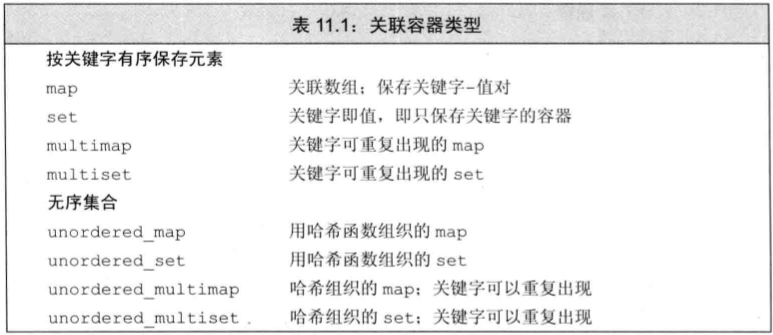
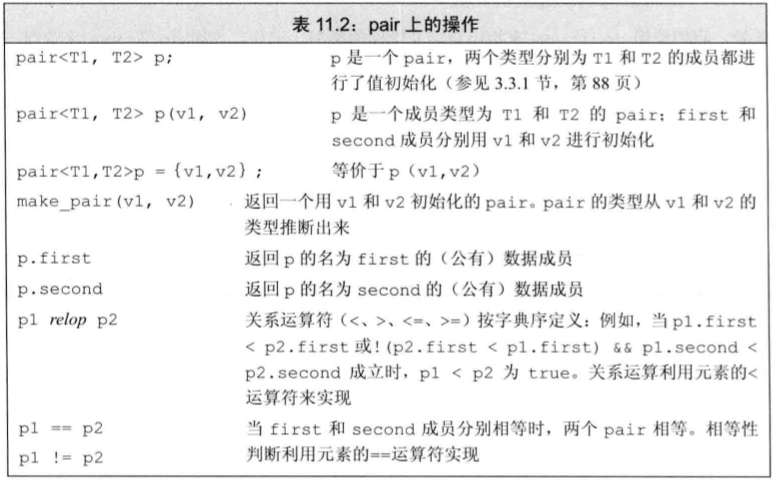
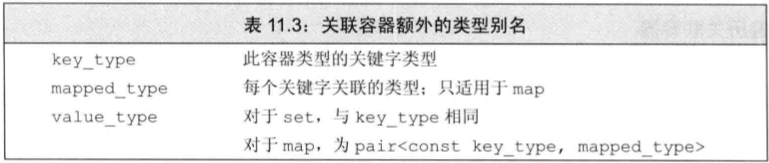
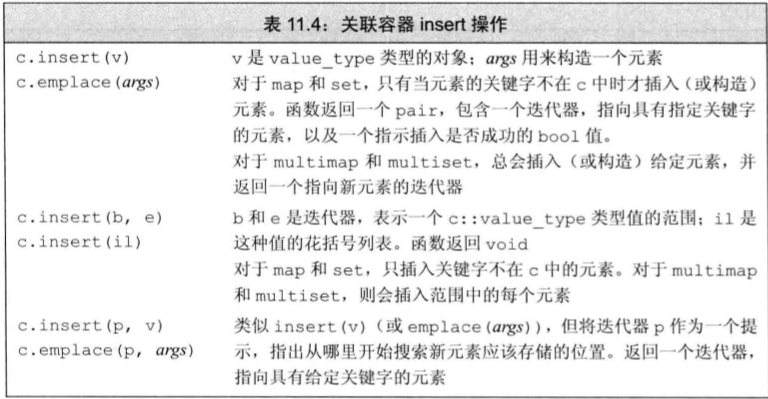
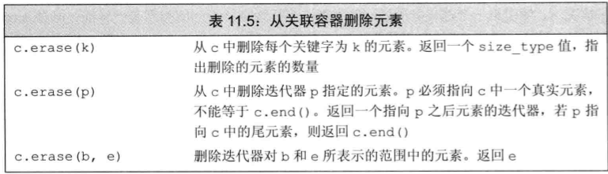
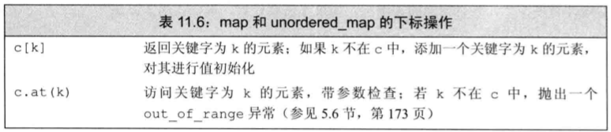
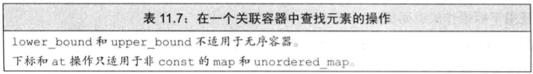
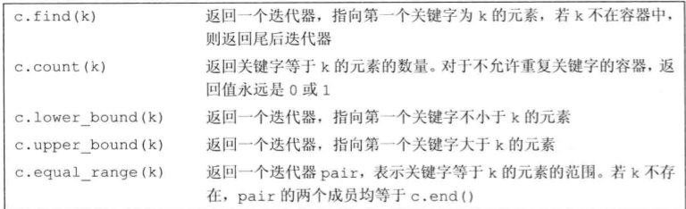
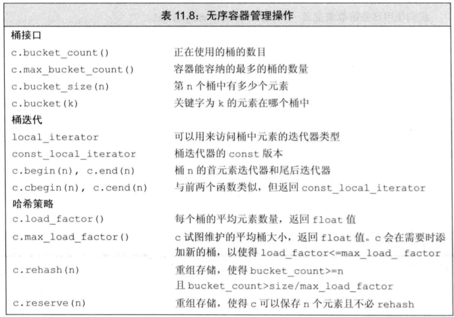

* 关联容器中的元素是按关键字来保存和访问的, 与之相对, 顺序容器时按它们在容器中的位置来顺序保存和访问的.
* 关联容器支持搞笑的关键字查找和访问.
  

***

# 11.1 使用关联容器
* `map`类型通常被称为**关联数组**.
* 单词计数:
    ```cpp
    // 统计每个单词在输入中出现的次数
    map<string, size_t> word_count; // 空map
    string word;
    while (cin >> word)
      ++word_count[word]; // 读取一个单词, 将其计数加1

    for (const auto &w : word_count) // 对map中的每个元素
        cout << w.first << " occurs " << w.second << ((w.second > 1) ? " times" : " time") << endl;
    ```
* 统计不在集合中的单词的数量
    ```cpp
    set<string> exclude = {"The", "But", "And", "Or", "An", "A",
                            "the", "but", "and", "or", "an", "a"};
    map<string, size_t> word_count; // 空map
    string word;
    while (cin >> word)
      if (exclude.find(word) == exclude.end())
        ++word_count[word]; // 读取一个单词, 将其计数加1

    for (const auto &w : word_count) // 对map中的每个元素
        cout << w.first << " occurs " << w.second << ((w.second > 1) ? " times" : " time") << endl;
    ```

***

# 11.2 关联容器概述
* 关联容器不支持顺序容器的位置相关的操作, 例如`push_back`, `push_front`, 因为关联容器中的元素是按关键字来保存和访问的.
* 关联容器的迭代器都是双向的.
  
## 11.2.1 定义关联容器
* 当定义一个map时, 必须既指定关键字类型, 又指定值类型.
* 定义一个set时, 只需指定关键字类型.
  ```cpp
    map<string, size_t> word_count; // 空map

    // 列表初始化
    set<string> exclude = {"The", "But", "And", "Or", "An", "A",
                            "the", "but", "and", "or", "an", "a"};
    // 三个元素的map
    map<string, string> authors = {
      {"Joyce", "James"},
      {"Austen", "Jane"},
      {"Dickens", "Charles"}
    };
  ```

* 一个map或set中的关键字必须是唯一的, 不能重复, 容器会自动忽略重复的关键字. 容器multimap和multiset没有这种限制.
  ```cpp
  // 定义一个有20个元素的vector, 保存0到9每个整数的两个拷贝
  vector<int> ivec;
  for (vector<int>::size_type i = 0; i != 10; ++i) {
    ivec.push_back(i);
    ivec.push_back(i);
  }

  // iset包含来自ivec的不重复元素, miset包含来自ivec的所有元素
  set<int> iset(ivec.cbegin(), ivec.cend());
  multiset<int> miset(ivec.cbegin(), ivec.cend());
  cout << "ivec: size: " << ivec.size()
       << endl;  // ivec: size: 20
  cout << "iset: size: " << iset.size() << endl;  // iset: size: 10
  cout << "miset: size: " << miset.size() << endl;  // miset: size: 20
  ```

## 11.2.2 关键字类型的要求
* 默认情况下, 标准库使用关键字类型的`<`运算符来组织元素的顺序.
* 传递给排序算法的可调用对象必须满足与关联容器中关键字一样的类型要求.
* **有序容器的关键字类型**:
  * 必须定义`<`运算符, 用于比较元素的大小.
  * 可以自定义`<`运算符, 所提供的的操作必须在关键字类型上定义一个**严格弱序**, 即小于等于. 需要满足以下性质:
    * 两个关键字不能同时"小于等于"对方, 如果k1"小于等于"k2, 那么k2"小于等于"k1.
    * 如果k1"小于等于"k2, 且k2"小于等于"k3, 那么k1"小于等于"k3.
    * 如果存在两个关键字, 任何一个都不"小于等于"另一个, 那么这两个关键字是等价的. 如果k1"小于等于"k2, 且k2"等价于"k3, 那么k1必须"等价于"k3.
  > 如果一个类型定义了"行为正常"的`<`运算符, 那么它就定义了一个严格弱序, 则可以用于关联容器的关键字类型.

* **使用关键字类型的比较函数**
  * 不能直接定义一个`Sales_data`的`multiset`, 因为`Sales_data`没有定义`<`运算符.
  * 使用函数`compareIsbn`来定义一个`multiset`:
    ```cpp
    bool compareIsbn(const Sales_data &lhs, const Sales_data &rhs) {
      return lhs.isbn() < rhs.isbn();
    }

    // 使用compareIsbn来定义一个multiset
    multiset<Sales_data, decltype(compareIsbn)*> bookstore(compareIsbn);
    ```
    > 定义multiset时需要提供两个类型: 关键字类型(Sells_data)和比较操作类型(一种函数指针类型), decltype(compareIsbn)返回的是函数类型, 加上`*`表示函数指针类型.

## 11.2.3 pair类型
* pair类型是一个模板, 定义在头文件utility中.
* 一个pair对象包含两个数据成员: first和second, 分别保存pair对象中的两个值.
  ```cpp
  pair<string, int> p1; // 默认初始化, first和second分别是string和int的默认初始化值
  pair<string, int> p2{"Anna", 27}; // 使用string和int的值初始化
  pair<string, vector<int>>   line; // 保存一个string和vector<int>
  ```
  > pair的默认初始化, first和second分别使用默认初始化.

* pair的数据成员是public的, 可以直接访问.
  ```cpp
  pair<string, int> p1;
  p1.first = "Anna";
  p1.second = 27;
  cout << p1.first << " " << p1.second << endl; // Anna 27
  ```


***

# 11.3 关联容器操作


## 11.3.1 关联容器迭代器
```cpp
// 获得指向word_count中第一个元素的迭代器
auto map_it = word_count.begin();
// *map_it是指向一个pair<const string, size_t>对象的引用
cout << map_it->first; // 打印第一个元素的关键字
cout << " " << map_it->second; // 打印第一个元素的值
map_it->first = "Anna"; // 错误: 关键字是const的
map_it->second = 42; // 修改第一个元素的值
```
* set的迭代器是const的, 不能修改set中的元素.
* 当使用一个迭代器遍历一个map, multimap, set或multiset时, 迭代器按照关键字的升序遍历元素.

## 11.3.2 添加元素
* 由于map和set(以及对应的无序类型)的关键字是唯一的, 因此插入一个已存在的关键字不会改变容器的内容.
  ```cpp
  vector<int> ivec = {2, 4, 6, 8, 2, 4, 6, 8};
  set<int> set2;  // 空集合
  set2.insert(ivec.cbegin(), ivec.cend());  // 将ivec中的元素拷贝到set2中, set2中有4个元素
  set2.insert({1, 3, 5, 7, 1, 3, 5, 7});  // 将花括号中的元素拷贝到set2中, set2中有8个元素
  ```

* 向map中添加元素必须是一个pair对象, 该pair对象的first成员是关键字, second成员是与该关键字相关联的值.
  ```cpp
  word_count.insert({word, 1});  // 向word_count中添加一个新元素
  word_count.insert(make_pair(word, 1));  // 向word_count中添加一个新元素
  word_count.insert(pair<string, size_t>(word, 1));  // 向word_count中添加一个新元素
  word_count.insert(map<string, size_t>::value_type(word, 1));  // 向word_count中添加一个新元素
  ```
  

* insert返回一个pair, 其中first成员是一个迭代器, 指向新添加的元素或者已经存在的元素; second成员是一个bool值, 表示元素是否被添加到容器中.
  ```cpp
  map<string, size_t> word_count;  // 空map
  string word;
  while (cin >> word) {
    auto ret = word_count.insert({word, 1});  // 向word_count中添加一个新元素
    if (!ret.second)  // 如果单词已经在word_count中
      ++((ret.first)->second);  // 将计数器加1
  }
  ```
  > 如果单词已经在word_count中, 则ret.second为false, ret.first指向word_count中的元素.

* 向multiset和multimap中添加元素时, 元素的关键字可以重复.
  ```cpp
  multiset<string> cset{"hello", "world"};
  cset.insert("hello");  // 向cset中添加一个新元素
  ```
  > 因为multiset和multimap的关键字可以重复, 所以insert返回一个迭代器, 指向新添加的元素, 无需返回一个bool值.

## 11.3.3 删除元素

> k指`key_type`类型, p为迭代器类型.

## 11.3.4 map的下标操作

> 使用一个不在容器中的关键字作为下标, 会将一个具有该关键字的元素添加到容器中.

## 11.3.5 访问元素
* `find`和`count`函数可以判断某一个特定元素是否在容器中, `count`还会返回该元素的个数.



* 对于语序重复关键字的容器来说, `multimap`或`multiset`中包含多个元素具有给定关键字, 则**这些元素在容器中会相邻存储**.
  ```cpp
  multiset<string> cset{"hello", "world", "hello"};
  auto beg = cset.lower_bound("hello");  // beg指向第一个关键字为"hello"的元素
  auto end = cset.upper_bound("hello");  // end指向第一个关键字不为"hello"的元素
  for (auto it = beg; it != end; ++it)
    cout << *it << " ";  // hello hello

  // 第二种方法
  auto cnt = cset.count("hello");  // cnt的值是2
  while (cnt) {
    cout << *beg << " ";  // hello hello
    ++beg;
    --cnt;
  }
  ```
  > 在遍历一个multimap或multiset时, 保证可以的到序列中所有具有给定关键字的元素.
  > 如果lower_bound和upper_bound返回相同的迭代器, 则表示容器中没有具有给定关键字的元素.

* 还可以使用`equal_range`函数来获取一个迭代器范围, 该范围表示容器中所有具有给定关键字的元素.
  ```cpp
  auto beg_end = cset.equal_range("hello"); 
  for (auto it = beg_end.first; it != beg_end.second; ++it)
    cout << *it << " ";  // hello hello
  ```
  > equal_range返回一个pair, 其中first成员是lower_bound返回的迭代器, second成员是upper_bound返回的迭代器.

***

# 11.4 无序容器
* 如果关键字类型固有就是无序的, 或者性能测试发现问题可以用哈希技术解决, 则可以使用无序容器.
* 无序容器的使用方法与关联容器类似.
* **无序容器在存储上组织为一组桶, 每个桶保存零个或多个元素.**
* **无序榕溪使用一个哈希函数将元素映射到桶.**
* 容器首先计算元素的哈希值, 指出应该搜索哪个桶, 然后在该桶中查找元素.
* **容器将具有一个特定哈希值的所有元素都保存在相同的桶中.**
* 如果容器允许具有相同关键字的元素, 则所有具有相同关键字的元素都保存在同一个桶中.
* **无序容器的性能取决于哈希函数的质量和桶的数量和大小.**
* 当一个桶保存多个元素时, 需要**顺序搜索**这些元素进行查找.

* 无序容器使用关键字类型的`==`运算符和一个`hash<key_type>`类型的对象来组织元素.
