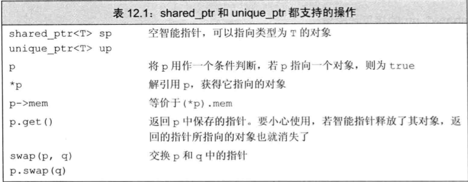
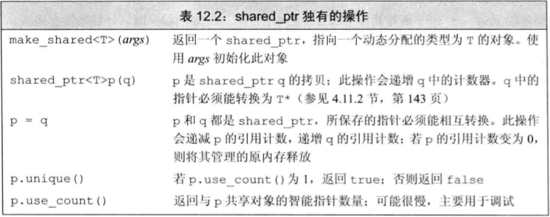
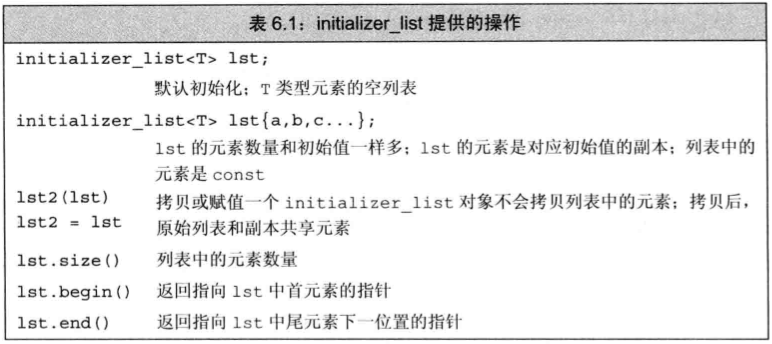

* 对象的生命周期:
  * **全局对**: 在程序启动时分配, 在程序结束时销毁.
  * **局部自动对象**: 进入其定义所在的块时分配, 离开其定义所在的块时销毁.
  * **static对象**: 在第一次使用前分配, 在程序结束时销毁.

* 除了自动和static对象外, C++还支持动态分配对象. 动态分配的对象的生存期由程序员控制, 与它们在哪里创建是无关的, 只有在显式地被释放时, 这些对象才会被销毁.
  
* 为了更安全地使用动态对象, 标准库定义了两个只能指针类型来管理动态分配的对象, 当一个对象应该被释放时, 指向它的智能指针可以确保自动地释放它.

# 12.1 动态内存与智能指针
* 动态内存的管理是处通过一对运算符来完成: `new`和`delete`. `new`运算符负责分配内存, `delete`运算符负责释放内存.
* 动态内存的使用很容易出现问题, 忘记释放内存, 可能会产生内存泄露; 释放了内存, 又使用它, 可能会产生悬空指针. 为了避免这些问题, C++标准库提供了智能指针, 用来管理动态内存.
* 只能指针可以自动释放所指的对象.
* `shared_atr`允许多个指针指向指向同一个对象.
* `unique_ptr`独占所指向的对象.
* `weak_ptr`是一种弱引用, 指向shared_ptr所管理的对象.
  > 上述三种类型都定义在memory头文件中

## 12.1.1 shared_ptr类
```cpp
shared_ptr<string> p1; // shared_ptr可以指向一个string对象, p1是一个空的shared_ptr
shared_ptr<list<int>> p2; // shared_ptr可以指向一个list<int>对象, p2是一个空的shared_ptr
```
> 默认初始化的智能指针中保存着一个空指针.




* `make_shared`在动态内存中分配一个对象并初始化它, 返回指向此对象的shared_ptr.
```cpp
// 指向一个值为42的int的shared_ptr
shared_ptr<int> p3 = make_shared<int>(42);
// 指向一个值为"9999-999-999"的string的shared_ptr
shared_ptr<string> p4 = make_shared<string>(10, '9');
// 指向一个初始化值的int的shared_ptr
shared_ptr<int> p5 = make_shared<int>();
```
* shared_ptr的拷贝和赋值:
  * 当进行拷贝或赋值时, 会拷贝或赋值一个指向相同对象的指针, 递增该对象的引用计数.
    ```cpp
    auto p = make_shared<int>(42);
    auto q(p); // q和p指向相同的对象, 该对象的引用计数加1
    ```
* 无论何时, 在拷贝一个shared_ptr时, 引用计数都会递增. 例如当用一个shared_ptr初始化另一个shared_ptr时, 或者将它作为参数传递给一个函数, 以及作为函数的返回值时, 引用计数都会递增.
* 当给shared_ptr赋予一个新值或shared_ptr被销毁时, 引用计数都会递减. 当引用计数变为0时, 指向的对象会被自动释放.
    ```cpp
    auto r = make_shared<int>(42); // r引用计数为1
    auto q(r); // 给r赋值, 令它指向另一个地址
                // 递增q指向的对象的引用计数
                // 递减r原来指向的对象的引用计数
                // r原来指向的对象已没有引用者, 会被释放
    ```

* 如果将shared_ptr存放于一个容器中, 而后不再需要全部元素, 而只需要其中一部分, 需要用erase删除不再需要的元素
* 使用动态内存的原因:
  * 程序不知道自己需要使用多少对象
  * 程序不知道所需对象的准确类型
  * 程序需要在多个对象间共享数据
  
* `initializer_list`形参
  * 如果函数的实参数量未知, 但是全部实参的类型都相同, 可以使用`initializer_list`类型的形参.
  * `initializer_list`是一种标准库类型, 用于表示某种特定类型的值的数组.
  
  * `initializer_list`类型的对象不能直接拷贝或赋值, 但是可以拷贝或赋值其元素.
  * `initializer_list`对象中的元素永远是常量值, 不能对其进行修改.
  ```cpp
  void error_msg(initializer_list<string> il)
  {
    for (auto beg = il.begin(); beg != il.end(); ++beg)
      cout << *beg << " ";
    cout << endl;
  }
  ```
  > 关于使用`initializer_list`, 而非`vector`的原因: `initializer_list`是一种标准库类型, 而非自定义类型, 因此可以使用标准库函数, 而非自定义函数.
  > [参考](https://www.jianshu.com/p/3d69ff89a0c9)

* 定义一个管理`string`的类, 命名为`StrBlob`
  * 使用`vector`来保存元素, 将`vector`保存在动态内存中.
  * 使用`shared_ptr`来管理`vector`的内存.
  * 此shared_ptr成员将记录有多少个`StrBlob`指向同一个`vector`, 并在vector的最后一个使用者被销毁时, 释放`vector`的内存.

```cpp 
class StrBlob {
  public:
    typedef std:;vector<std::string>::size_type size_type;
    StrBlob();
    StrBlob(std::initializer_list<std::string> il);
    size_type size() const { return data->size(); }
    bool empty() const { return data->empty(); }
    // 添加和删除元素
    void push_back(const std::string &t) { data->push_back(t); }
    void pop_back();
    // 元素访问
    std::string& front();
    std::string& back();
  private:
    std::shared_ptr<std::vector<std::string>> data;
    // 如果data[i]不合法, 抛出一个异常
    void check(size_type i, const std::string &msg) const;
};

// 构造函数
StrBlob::StrBlob() : data(make_shared<std::vector<std::string>>()) { }
StrBlob::StrBlob(std::initializer_list<std::string> il) :
  data(make_shared<std::vector<std::string>>(il)) { }

// check函数检查一个给定索引是否在非法范围内. 另外还接受一个string参数, 用于生成异常信息.
void StrBlob::check(size_type i, const std::string &msg) const
{
  if (i >= data->size())
    throw out_of_range(msg);
}

// 元素访问函数的实现
string &StrBlob::front()
{
  // 如果vector为空, check会抛出一个异常
  check(0, "front on empty StrBlob");
  return data->front();
}

string &StrBlob::back()
{
  check(0, "back on empty StrBlob");
  return data->back();
}

void StrBlob::pop_back()
{
  check(0, "pop_back on empty StrBlob");
  data->pop_back();
}
```

## 12.1.2 直接管理内存
* C++定义了两个运算符来分配和释放动态内存:
  * `new`: 分配未命名的内存, 返回指向该内存的指针.
  * `delete`: 释放由`new`分配的内存.
  * `new[]`: 分配未命名的内存, 返回指向该内存的指针.
  * `delete[]`: 释放由`new[]`分配的内存.

* `new`运算符
  * `new`无法为其分配的对象命名, 而是返回一个指向该对象的指针.
  ```cpp
  int *p = new int; // p指向一个未初始化的int
  string *ps = new string; // ps指向一个空string
  int *pi = new int(1024); // pi指向一个值为1024的int
  string *ps = new string(10, '9'); // ps指向一个值为9999999999的string
  vector<int> *pv = new vector<int>{0, 1, 2, 3, 4, 5, 6, 7, 8, 9}; // pv指向一个包含10个元素的vector
  ```
  > 默认情况下, 动态分配的对象是默认初始化的. 这内置类型或组合类型的对象的值将是未定义的, 而类类型对象将用默认构造函数初始化.

  * 可以对**动态分配的对象进行值初始化**, 只需在类型名后面跟一对空括号即可.
  ```cpp
  string *ps = new string; // 默认初始化为空string
  string *ps = new string(); // 值初始化为空string
  int *pi = new int; // 默认初始化为; 未定义
  int *pi = new int(); // 值初始化为0
  ```
  
  * 使用`auto`关键字, 可以让编译器推断出`new`表达式的类型.
  ```cpp
  auto p = new auto(obj); // p指向obj类型的对象
  auto q = new auto{a, b, c}; // 错误, 括号中只能有单个初始化器
  ```

  * 动态分配const对象
  ```cpp
  // 分配并初始化一个const int
  const int *pci = new const int(1024);
  // 分配并初始化一个const string
  const string *pcs = new const string;
  ```
  > 类似于其他的const对象, 一个动态分配的const对象必须进行初始化. 由于分配的对象时const的, new返回的指针是一个指向const的指针.

  * 在默认情况下, 如果new不能分配所要求的内存空间, **将抛出一个`bad_alloc`异常**. 如果不想让new抛出异常, 可以使用`nothrow`版本的new.
  ```cpp
  // 如果分配失败, new将返回一个空指针
  int *p1 = new int; // 如果分配失败, new将抛出一个异常
  int *p2 = new (nothrow) int; // 如果分配失败, new将返回一个空指针
  ```
  > `nothrow`版本的new不会抛出异常, 而是返回一个空指针. 因此, 如果使用`nothrow`版本的new, 必须检查返回的指针是否为空.

  * 在动态内存使用完毕后, 必须将其归还给系统, 通过使用`delete`运算符来完成.
  ```cpp
  int *p = new int(42);
  delete p; // 释放p指向的内存
  ```
  > 与new相似, delete表达式也指向两个动作, 销毁给定的指针指向的对象, 释放对应的内存.

  * 传递给delete的指针**必须指向动态分配的内存, 或者是一个空指针**, 释放一块非new分配的内存, 或者将相同的指针释放多次, 其行为是未定义的.
  ```cpp
  int i, *pi1 = &i, *pi2 = nullptr;
  double *pd = new double(33), *pd2 = pd;
  delete i; // 错误: i不是指针
  delete pi1; // 未定义, pi1指向一个局部变量
  delete pd; // 正确
  delete pd2; // 未定义, pd2指向的内存已经被释放
  delete pi2; // 正确, pi2是一个空指针

  // 释放const对象
  const int *pci = new const int(1024);
  delete pci; // 正确
  ```

* 由内置指针而非智能指针管理的动态内存在被显式释放前一直都会存在. 
* 在delete一个指针后, 该指针就变成了一个悬垂指针, 指向的内存已经被释放, 但是指针仍然指向该内存. 如果在释放内存后, 仍然使用该指针, 将导致未定义的行为.
* 为了避免空悬指针, 通常将指向动态内存的指针设置为`nullptr`. 但是, 这个方法只对当前指针有效, 如果有其他指针指向该内存, 仍然会导致悬垂指针.
  ```cpp
  int *p = new int(42);  // p指向动态内存
  auto q = p;  // q指向p指向的内存
  delete p;  // 释放p指向的内存
  p = nullptr;  // p是一个空指针
  *q = 0;  // 未定义, q指向的内存已经被释放
  ```

## 12.1.3 shared_ptr和new结合使用
* 可以使用new返回的指针来初始化智能指针
  ```cpp
  shared_ptr<double> p1;  // shared_ptr可以指向double
  shared_ptr<int> p2(new int(42));  // p2指向一个值为42的int
  ```

