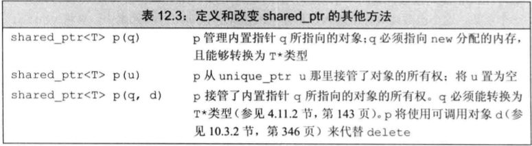
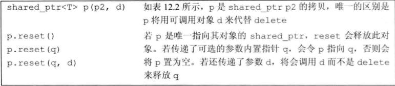
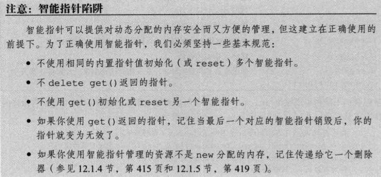
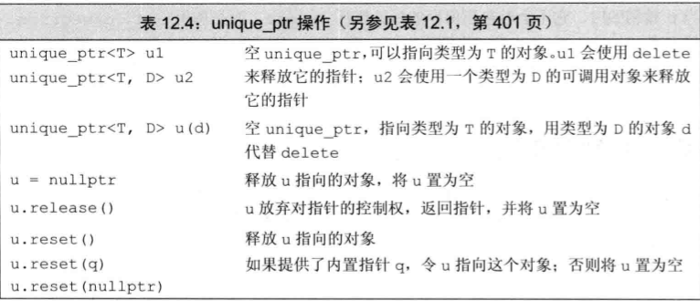
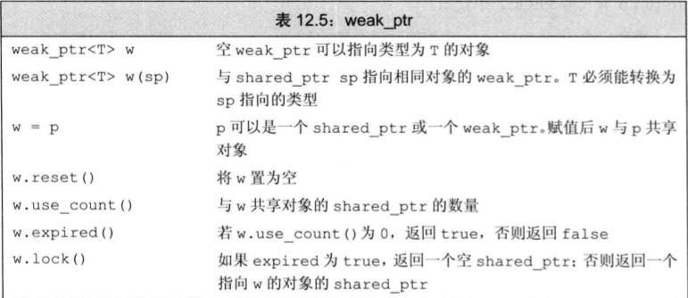
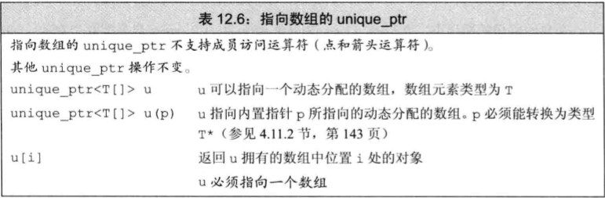
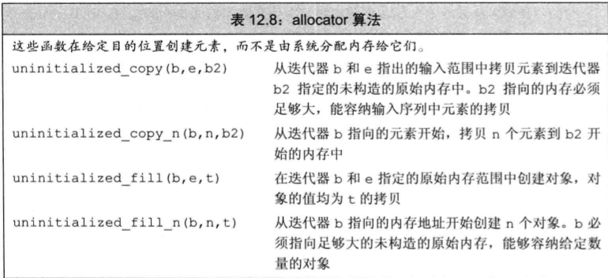

* 对象的生命周期:
  * **全局对**: 在程序启动时分配, 在程序结束时销毁.
  * **局部自动对象**: 进入其定义所在的块时分配, 离开其定义所在的块时销毁.
  * **static对象**: 在第一次使用前分配, 在程序结束时销毁.

* 除了自动和static对象外, C++还支持动态分配对象. 动态分配的对象的生存期由程序员控制, 与它们在哪里创建是无关的, 只有在显式地被释放时, 这些对象才会被销毁.
  
* 为了更安全地使用动态对象, 标准库定义了两个只能指针类型来管理动态分配的对象, 当一个对象应该被释放时, 指向它的智能指针可以确保自动地释放它.

# 12.1 动态内存与智能指针
* 动态内存的管理是处通过一对运算符来完成: `new`和`delete`. `new`运算符负责分配内存, `delete`运算符负责释放内存.
* 动态内存的使用很容易出现问题, 忘记释放内存, 可能会产生内存泄露; 释放了内存, 又使用它, 可能会产生悬空指针. 为了避免这些问题, C++标准库提供了智能指针, 用来管理动态内存.
* 只能指针可以自动释放所指的对象.
* `shared_atr`允许多个指针指向指向同一个对象.
* `unique_ptr`独占所指向的对象.
* `weak_ptr`是一种弱引用, 指向shared_ptr所管理的对象.
  > 上述三种类型都定义在memory头文件中

## 12.1.1 shared_ptr类
```cpp
shared_ptr<string> p1; // shared_ptr可以指向一个string对象, p1是一个空的shared_ptr
shared_ptr<list<int>> p2; // shared_ptr可以指向一个list<int>对象, p2是一个空的shared_ptr
```
> 默认初始化的智能指针中保存着一个空指针.


* `make_shared`在动态内存中分配一个对象并初始化它, 返回指向此对象的shared_ptr.
```cpp
// 指向一个值为42的int的shared_ptr
shared_ptr<int> p3 = make_shared<int>(42);
// 指向一个值为"9999-999-999"的string的shared_ptr
shared_ptr<string> p4 = make_shared<string>(10, '9');
// 指向一个初始化值的int的shared_ptr
shared_ptr<int> p5 = make_shared<int>();
```
* shared_ptr的拷贝和赋值:
  * 当进行拷贝或赋值时, 会拷贝或赋值一个指向相同对象的指针, 递增该对象的引用计数.
    ```cpp
    auto p = make_shared<int>(42);
    auto q(p); // q和p指向相同的对象, 该对象的引用计数加1
    ```
* 无论何时, 在拷贝一个shared_ptr时, 引用计数都会递增. 例如当用一个shared_ptr初始化另一个shared_ptr时, 或者将它作为参数传递给一个函数, 以及作为函数的返回值时, 引用计数都会递增.
* 当给shared_ptr赋予一个新值或shared_ptr被销毁时, 引用计数都会递减. 当引用计数变为0时, 指向的对象会被自动释放.
    ```cpp
    auto r = make_shared<int>(42); // r引用计数为1
    auto q(r); // 给r赋值, 令它指向另一个地址
                // 递增q指向的对象的引用计数
                // 递减r原来指向的对象的引用计数
                // r原来指向的对象已没有引用者, 会被释放
    ```

* 如果将shared_ptr存放于一个容器中, 而后不再需要全部元素, 而只需要其中一部分, 需要用erase删除不再需要的元素
* 使用动态内存的原因:
  * 程序不知道自己需要使用多少对象
  * 程序不知道所需对象的准确类型
  * 程序需要在多个对象间共享数据
  
* `initializer_list`形参
  * 如果函数的实参数量未知, 但是全部实参的类型都相同, 可以使用`initializer_list`类型的形参.
  * `initializer_list`是一种标准库类型, 用于表示某种特定类型的值的数组.
  
  * `initializer_list`类型的对象不能直接拷贝或赋值, 但是可以拷贝或赋值其元素.
  * `initializer_list`对象中的元素永远是常量值, 不能对其进行修改.
  ```cpp
  void error_msg(initializer_list<string> il)
  {
    for (auto beg = il.begin(); beg != il.end(); ++beg)
      cout << *beg << " ";
    cout << endl;
  }
  ```
  > 关于使用`initializer_list`, 而非`vector`的原因: `initializer_list`是一种标准库类型, 而非自定义类型, 因此可以使用标准库函数, 而非自定义函数.
  > [参考](https://www.jianshu.com/p/3d69ff89a0c9)

* 定义一个管理`string`的类, 命名为`StrBlob`
  * 使用`vector`来保存元素, 将`vector`保存在动态内存中.
  * 使用`shared_ptr`来管理`vector`的内存.
  * 此shared_ptr成员将记录有多少个`StrBlob`指向同一个`vector`, 并在vector的最后一个使用者被销毁时, 释放`vector`的内存.

```cpp 
class StrBlob {
  public:
    typedef std:;vector<std::string>::size_type size_type;
    StrBlob();
    StrBlob(std::initializer_list<std::string> il);
    size_type size() const { return data->size(); }
    bool empty() const { return data->empty(); }
    // 添加和删除元素
    void push_back(const std::string &t) { data->push_back(t); }
    void pop_back();
    // 元素访问
    std::string& front();
    std::string& back();
  private:
    std::shared_ptr<std::vector<std::string>> data;
    // 如果data[i]不合法, 抛出一个异常
    void check(size_type i, const std::string &msg) const;
};

// 构造函数
StrBlob::StrBlob() : data(make_shared<std::vector<std::string>>()) { }
StrBlob::StrBlob(std::initializer_list<std::string> il) :
  data(make_shared<std::vector<std::string>>(il)) { }

// check函数检查一个给定索引是否在非法范围内. 另外还接受一个string参数, 用于生成异常信息.
void StrBlob::check(size_type i, const std::string &msg) const
{
  if (i >= data->size())
    throw out_of_range(msg);
}

// 元素访问函数的实现
string &StrBlob::front()
{
  // 如果vector为空, check会抛出一个异常
  check(0, "front on empty StrBlob");
  return data->front();
}

string &StrBlob::back()
{
  check(0, "back on empty StrBlob");
  return data->back();
}

void StrBlob::pop_back()
{
  check(0, "pop_back on empty StrBlob");
  data->pop_back();
}
```

## 12.1.2 直接管理内存
* C++定义了两个运算符来分配和释放动态内存:
  * `new`: 分配未命名的内存, 返回指向该内存的指针.
  * `delete`: 释放由`new`分配的内存.
  * `new[]`: 分配未命名的内存, 返回指向该内存的指针.
  * `delete[]`: 释放由`new[]`分配的内存.

* `new`运算符
  * `new`无法为其分配的对象命名, 而是返回一个指向该对象的指针.
  ```cpp
  int *p = new int; // p指向一个未初始化的int
  string *ps = new string; // ps指向一个空string
  int *pi = new int(1024); // pi指向一个值为1024的int
  string *ps = new string(10, '9'); // ps指向一个值为9999999999的string
  vector<int> *pv = new vector<int>{0, 1, 2, 3, 4, 5, 6, 7, 8, 9}; // pv指向一个包含10个元素的vector
  ```
  > 默认情况下, 动态分配的对象是默认初始化的. 这内置类型或组合类型的对象的值将是未定义的, 而类类型对象将用默认构造函数初始化.

  * 可以对**动态分配的对象进行值初始化**, 只需在类型名后面跟一对空括号即可.
  ```cpp
  string *ps = new string; // 默认初始化为空string
  string *ps = new string(); // 值初始化为空string
  int *pi = new int; // 默认初始化为; 未定义
  int *pi = new int(); // 值初始化为0
  ```
  
  * 使用`auto`关键字, 可以让编译器推断出`new`表达式的类型.
  ```cpp
  auto p = new auto(obj); // p指向obj类型的对象
  auto q = new auto{a, b, c}; // 错误, 括号中只能有单个初始化器
  ```

  * 动态分配const对象
  ```cpp
  // 分配并初始化一个const int
  const int *pci = new const int(1024);
  // 分配并初始化一个const string
  const string *pcs = new const string;
  ```
  > 类似于其他的const对象, 一个动态分配的const对象必须进行初始化. 由于分配的对象时const的, new返回的指针是一个指向const的指针.

  * 在默认情况下, 如果new不能分配所要求的内存空间, **将抛出一个`bad_alloc`异常**. 如果不想让new抛出异常, 可以使用`nothrow`版本的new.
  ```cpp
  // 如果分配失败, new将返回一个空指针
  int *p1 = new int; // 如果分配失败, new将抛出一个异常
  int *p2 = new (nothrow) int; // 如果分配失败, new将返回一个空指针
  ```
  > `nothrow`版本的new不会抛出异常, 而是返回一个空指针. 因此, 如果使用`nothrow`版本的new, 必须检查返回的指针是否为空.

  * 在动态内存使用完毕后, 必须将其归还给系统, 通过使用`delete`运算符来完成.
  ```cpp
  int *p = new int(42);
  delete p; // 释放p指向的内存
  ```
  > 与new相似, delete表达式也指向两个动作, 销毁给定的指针指向的对象, 释放对应的内存.

  * 传递给delete的指针**必须指向动态分配的内存, 或者是一个空指针**, 释放一块非new分配的内存, 或者将相同的指针释放多次, 其行为是未定义的.
  ```cpp
  int i, *pi1 = &i, *pi2 = nullptr;
  double *pd = new double(33), *pd2 = pd;
  delete i; // 错误: i不是指针
  delete pi1; // 未定义, pi1指向一个局部变量
  delete pd; // 正确
  delete pd2; // 未定义, pd2指向的内存已经被释放
  delete pi2; // 正确, pi2是一个空指针

  // 释放const对象
  const int *pci = new const int(1024);
  delete pci; // 正确
  ```

* 由内置指针而非智能指针管理的动态内存在被显式释放前一直都会存在. 
* 在delete一个指针后, 该指针就变成了一个悬垂指针, 指向的内存已经被释放, 但是指针仍然指向该内存. 如果在释放内存后, 仍然使用该指针, 将导致未定义的行为.
* 为了避免空悬指针, 通常将指向动态内存的指针设置为`nullptr`. 但是, 这个方法只对当前指针有效, 如果有其他指针指向该内存, 仍然会导致悬垂指针.
  ```cpp
  int *p = new int(42);  // p指向动态内存
  auto q = p;  // q指向p指向的内存
  delete p;  // 释放p指向的内存
  p = nullptr;  // p是一个空指针
  *q = 0;  // 未定义, q指向的内存已经被释放
  ```

## 12.1.3 shared_ptr和new结合使用
* 可以使用new返回的指针来初始化智能指针
  ```cpp
  shared_ptr<double> p1;  // shared_ptr可以指向double
  shared_ptr<int> p2(new int(42));  // p2指向一个值为42的int

  // 接收指针参数的智能指针的构造函数是explicit的, 因此不能使用隐式转换
  shared_ptr<int> p3 = new int(1024);  // 错误, 不能将int*转换为shared_ptr<int>
  shared_ptr<int> p4 = make_shared<int>(1024);  // 正确, make_shared返回一个shared_ptr
  shared_ptr<int> p5(new int(1024));  // 正确, 使用了直接初始化
  ```


 
* 不要混合使用普通指针和智能指针管理同一块内存
  ```cpp
  // 一个使用智能指针的函数
  void process(shared_ptr<int> ptr) {
    // 使用ptr, 引用计数加一
  } // 离开作用域, 引用计数减一

  // 正确方式:
  shared_ptr<int> p(new int(42));  // 引用计数为1
  process(p);  // 引用计数为2
  int i = *p;  // 引用计数为1

  // 错误方式:
  int *q = new int(42);  // q指向一个动态分配的int
  process(q);  // 错误, q是一个内置指针
  process(shared_ptr<int>(q));  // 正确, 但内存会释放
  int j = *q;  // 错误, q指向的内存已经被释放, q是一个悬垂指针
  ```

* `get`成员函数返回一个内置指针, 指向智能指针管理的对象.
  ```cpp
  shared_ptr<int> p(new int(42));
  int *q = p.get();  // q指向p指向的内存
  ```
  > 由于`get`返回的是一个内置指针, 因此可以使用`get`来初始化另一个智能指针. 但是, 这样做会导致两个智能指针指向同一块内存, 会导致引用计数错误. 因此, 通常不应该使用`get`来初始化另一个智能指针. 同时在使用`get`时, 应该确定代码不会delete该指针.

* `reset`成员函数将一个新的指针赋予一个shared_ptr对象, 并释放shared_ptr原来指向的对象.
  ```cpp
  shared_ptr<int> p(new int(42));
  p.reset(new int(0));  // 释放p指向的内存, p指向一个值为0的int
  ```
  > `reset`会释放原来的内存, 并将指针置为一个新的指针. 如果`reset`的参数为空, 则会释放原来的内存, 并将指针置为空.

* `reset`常常与`unique`一起使用, 控制多个`shared_ptr`共享的对象, 在改变底层对象之前, 检查是否是当前对象仅有的用户, 如果不是, 在改变前制作一份新的拷贝.
  ```cpp
  if (!p.unique())  // 如果有其他shared_ptr指向相同的内存
    p.reset(new string(*p));  // 拷贝底层string
  *p += val;  // 现在我们知道p指向的是唯一的string
  ```

## 12.1.4 智能指针和异常
* 使用智能指针, 即使程序块过早结束, 智能指针也能确保内存被释放; 而使用内置指针时, 如果在程序块中发生异常, 则可能导致内存泄漏.
  ```cpp
  // 使用智能指针
  void fcn() {
    shared_ptr<int> p(new int(42));
    // 使用p, 期间发生异常, 函数块结束, p被销毁, 内存被释放
  } // 离开作用域, p被销毁, 内存被释放

  // 使用内置指针
  void fcn() {
    int *p = new int(42);
    // 使用p, 期间发生异常, 函数块结束, p被销毁, 内存未被释放
  } // 离开作用域, p被销毁, 内存未被释放
  ```

* 智能指针在释放内存时, 使用`delete`运算符, 调用的是类的析构函数, 对于为C和C++两种语言设计的类, 通常不含有析构函数, 需要用户显示的释放所有使用的资源.
  ```cpp
  struct destination;  // 表示正在连接的目的地
  struct connection;  // 表示打开的连接
  connection connect(destination*);  // 打开连接
  void disconnect(connection);  // 关闭连接
  void f(destination &d) {
    connection c = connect(&d);  // 打开连接
    // 使用连接
    // 如果在此处发生异常, 则连接不会关闭
    disconnect(c);  // 关闭连接
  }
  ```
  > connection没有析构函数, 因此在f函数结束时, 连接不会关闭. 

* 在使用智能指针时, 可以定义一个函数来代替`delete`操作, 这个函数称之为`删除器`, 这个函数**必须能够完成对shared_ptr中保存的指针进行释放的操作.
  `````cpp
  void end_connection(connection *p) { disconnect(*p); }  // 删除器
  void f(destination &d) {
    connection c = connect(&d);  // 打开连接
    shared_ptr<connection> p(&c, end_connection);  // 使用删除器
    // 使用连接
    // 如果在此处发生异常, 则连接会关闭
  } // 离开作用域, p被销毁, 连接关闭
  `````


## 12.1.5 unique_ptr
* `unique_ptr`是一种智能指针, 它拥有它所指向的对象. 在某个时刻智能有一个`unique_ptr`指向给定对象, 当`unique_ptr`被销毁时, 它所指向的对象也会被销毁.
  ```cpp
  unique_ptr<string> p1(new string("hi"));  // p1指向一个string
  unique_ptr<string> p2(p1);  // 错误, unique_ptr不能拷贝
  unique_ptr<string> p3 = p2;  // 错误, unique_ptr不能拷贝
  unique_ptr<string> p4;  // 正确, p4是一个空的unique_ptr
  p4 = p3;  // 错误, unique_ptr不能拷贝
  ```
  > `unique_ptr`不能拷贝或赋值, 因为它的拷贝和赋值操作会导致两个`unique_ptr`指向同一块内存, 从而导致内存泄漏.


* 虽然不能拷贝或赋值, 但是可以使用`release`和`reset`来转移`unique_ptr`的所有权.
  ```cpp
  unique_ptr<string> p1(new string("hi"));  // p1指向一个string
  unique_ptr<string> p2(p1.release());  // p2接管p1的内存
  unique_ptr<string> p3;  // p3是一个空的unique_ptr
  p3.reset(p2.release());  // p3接管p2的内存
  ```
  > `release`返回一个内置指针, 指向`unique_ptr`原来指向的对象, 并将`unique_ptr`置为空. `reset`接受一个内置指针, 将`unique_ptr`置为指向该指针所指向的对象, 并释放`unique_ptr`原来指向的对象.

* 虽然不能拷贝`unique_ptr`, 但是可以拷贝或赋值一个将要被销毁的`unique_ptr`, 如从函数返回一个`unique_ptr`.

* 与shared_ptr不同, `unique_ptr`在传递删除器的时候, 需要在尖括号中unique_ptr指向类型之后提供删除器的类型, 在创建或reset一个这种unique_ptr类型的对象的时候, 必须提供一个指定类型凯尔可调用对象.
  ```cpp
  // p指向一个类型为objT的对象, 使用一个类型为delT的可调用对象来释放p
  // 它会调用一个名为fcn的delT类型的对象来释放p
  unique_ptr<objT, delT> p(new objT, fcn);
  
  // 一个实际的例子:
  void f(destination &d) {
    connection c = connect(&d);  // 打开连接
    unique_ptr<connection, decltype(end_connection)*>
      p(&c, end_connection);  // 使用删除器
    // 使用连接
    // 如果在此处发生异常, 则连接会关闭
  } // 离开作用域, p被销毁, 连接关闭
  ```

## 12.1.6 weak_ptr
* weak_ptr是一种不控制所指向对象生存期的智能指针, 它指向一个由shared_ptr管理的对象.
  ```cpp
  shared_ptr<int> p(new int(42));
  weak_ptr<int> wp(p);  // wp指向p所管理的对象
  ```
  > weak_ptr不控制所指向对象的生存期, 因此它不会增加shared_ptr的引用计数.

* `weak_ptr`常用在**循环引用**的场景中.
  * 如两个类, 互相包含对方的指针, 初始化的时候, 两个指针都指向对方, 此时两个类的引用计数为2, 无法被销毁.
  [参考: weak_ptr的两个使用场景](https://blog.csdn.net/whahu1989/article/details/122443129)

***

# 12.2 动态数组
* C++语言定义了另一种new表达式语法, 可以分配一个对象数组.
* 标准库中包含一个名为`allocator`的类, 允许将分配和初始化分离.
## 12.2.1 new和数组
* 为了让new分配一个对象数组, 需要在类型名后面跟一对方括号, 在其中指明要分配的对象的数目.
  ```cpp
  // 调用get_size确定分配多少个int
  int *pia = new int[get_size()]; // pia指向第一个int元素

  // 可以使用类型别名来进行定义
  typedef int arrT[42];  // arrT是一个含有42个int的数组
  int *p = new arrT;  // p指向一个含有42个int的数组, 可以省略方括号
  ```
  > 方括号中的大小必须是整形, 但不必是常量.

* **当使用new分配一个数组时, 并未得到一个数组类型的对象, 而是得到一个数组元素类型的指针.**
* 由于分配的内存不是一个数组类型, 因此**不能对动态数组调用begin和end; 同样也不能使用范围for语句来处理动态数组**
* **初始化动态分配对象的数组**
  * 在默认情况下, new分配的对象, 不管是单个分配的还是数组中的, 都是默认初始化的.
  * 在数组大小后面跟一个空括号, 可以进行值初始化.
  * 在后面加上花括号列表, 可以进行列表初始化.
  ```cpp
  int *pia = new int[10]; // 10个未初始化的int
  int *pia2 = new int[10](); // 10个初始化为0的int
  string *psa = new string[10]; // 10个空string
  string *psa2 = new string[10](); // 10个空string
  int *pia3 = new int[10]{0, 1, 2, 3, 4, 5, 6, 7, 8, 9};
  char *cp = new char[0]; // 可以分配大小为0的数组, 但不能解引用
  ```

* 为了释放动态数组, 必须使用`delete[]`运算符.
  ```cpp
  int *pia = new int[10];
  delete[] pia;  // 释放pia指向的内存
  ```
  > 释放动态数组时, 必须使用`delete[]`, 否则会导致内存泄漏.

* **智能指针和动态数组**
  * 标准库提供了可管理new分配的数组的`unique_ptr`版本, 无法使用点和箭头成员运算符, 但是可以使用下标运算符.
  ```cpp
  // up指向一个包含10个未初始化的int数组
  unique_ptr<int[]> up(new int[10]);  // 注意尖括号中需要加上方括号
  up.release();  // 自动使用delete[]销毁
  up[2] = 3;  // 可使用下标运算符
  ```
  

  * 如果想使用`shared_ptr`去管理动态数组, 必须提供自定义的删除器, 同时无法使用点和箭头成员运算符, 也无法使用下标运算符.
  ```cpp
  // 自定义一个删除器
  shared_ptr<int> sp(new int[10], [](int *p){ delete[] p;});
  *(sp.get() + i) = i;  // 使用get获取内置指针, 进行访问
  sp.reset();  // 使用自定义删除器进行释放
  ```

## 12.2.2 allocator类 
* `allocator`类定义在头文件`memory`中, 它是一个模板类, 可以分配和释放对象, 但不负责对象的初始化和销毁.
  ```cpp
  allocator<string> alloc;  // 可分配string的allocator对象
  auto const p = alloc.allocate(n);  // 分配n个未初始化的string
  auto q = p;  // q指向第一个元素
  alloc.construct(q++);  // *q为空string
  alloc.construct(q++, 10, 'c');  // *q为cccccccccc
  alloc.construct(q++, "hi");  // *q为hi
  while (q != p) alloc.destroy(--q);  // 逆序销毁元素
  alloc.deallocate(p, n);  // 释放内存
  ```
  

* `allocator`类包含两个伴随算法, 可在未初始化内存中创建对象
  
```cpp
// 未初始化内存中创建对象
auto p = alloc.allocate(n);  // 分配n个未初始化的string
auto q = uninitialized_copy(b, e, p);  // 将b和e范围内的元素拷贝到p指向的内存中
uninitialized_fill_n(q, n, t);  // 将t拷贝到q指向的内存中, 拷贝n个
```
> uninitialized_copy回一个指向最后一个拷贝元素之后位置的迭代器.