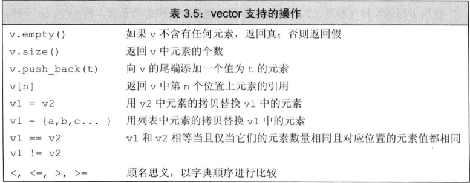

[toc]

# 3.2 标准库类型string
## 3.2.2 string对象上的操作

* 读写

  * 使用标准库(iostream)中的std::cin读取

    * 从第一个非空白符开始读取
    * 在下一处空白结束

    ```c++
    int main()
    {
        string s1, s2;
        cin >> s1 >> s2;
        cout << s1 << endl;
        cout << s1 << s2 << endl;
        
        return 0;
    }
    ```

    > 输入"    Hello world", 输出"Hello" "Helloworld"

  * 使用getline读取一整行
    * `getline(cin, line)`
    * 该函数从给定的输入流中读入内容, 直到遇到换行符为止(换行符也被读入)
    * 内容存到string对象中(不包括换行符)


* **empty**和**size**

  1. empty

     * 使用.操作符, 如果字符串为空, 返回true

  2. size

     * size函数返回字符串的长度

     * size函数返回的值类型为**string::size_type**

       * 可通过auto或者decltype来推断string::size_type

       * string::size_type为unsigned, 不应与int值进行比较

         > 若n为负值的int, 则s.size() < n的判断几乎恒为true, 因为在比较过程中, 负值n会转换为一个比较大的无符号值.

* 处理string中的单个字符
  1. 可以通过`for (auto c : str)`来遍历string中的每一个字符(c的类型为char)
  2. 可以通过**下标运算符**访问string对应下标处的字符(下标必须大于0小于str.size()), 下标的类型为`string::size_type`
  3. 通过`auto`遍历一个`const string`, 其类型为`const char`

***

# 3.3 标准库类型 vector
## 3.3.1 定义和初始化vector对象
* vector的初始化方式:
  1. 默认初始化`vector<string> svec;` 不含任何元素
  2. 列表初始化(使用花括号)
   `vector<string> v1{"a", "b", "c"};`
  3. 创建指定数量的元素
   `vector<string> ivec(10, "a"); // 共十个string类型的元素, 每个都初始化为"a"`
  4. 值初始化
   `vector<int> ivec(10); // 十个初始化值为0的元素`
   
* 列表初始值和元素数量
  1. vector<int> v1(10); // v1有10个初始化为0的元素
  2. vector<int> v2{10}; // v2有1个元素, 值为10

  3. vector<int> v3(10, 1); // v3有10个初始化值为1的元素
  4. vector<int> v4{10, 1}; // v4有两个元素, 分别为10, 1

  5. vector<string> v5{"hi"}; // v5有一个初始化值为"hi"的元素
  6. vector<string> v6("hi"); // v6无法构造, 无const char[]的构造
  7. vector<string> v7{10}; // v7有10个默认初始值的元素
  8. vector<string> v8{10, "hi"}; // v8有10个值为"hi"的元素
    > 如果是圆括号, 值用来构造(construct)vector.
    > 如果是花括号, 及可能为列表初始化, 列表初始化必须使用和vector元素类型相同.
</br>
## 3.3.2 向vector对象中添加元素
* 通过`push_back()`向vector尾端添加元素.
  > C++标准要求vector应该能在运行时高效快速地添加元素, 故多数情况下, 会**创建空的vector对象, 在运行时动态添加元素**.

## 3.3.3 其他vector操作


> 要使用`size_type`, 需首先指定其定义类型, **vector对象的类型总是包含着元素的类型**
> vector<int>::size_type  // 正确
> vector::size_type // 错误

* 相等性运算符和关系运算符只有在元素可比较时才能比较

* 下标运算符:
  1. **vector对象(以及string对象)的下标运算符可用于访问已存在的元素, 而不能用于添加元素**
  2. 只能对确知已存在的元素执行下标操作
  > 试图用下标的形式访问一个不存在的元素将引发错误, 这种错误不会被编译器发现, 而是在运行时产生一个不可预知的值, 所谓的缓冲区溢出(buffer overflow)指的就是这种错误
  > 确保下标合法的一种有效手段就是尽可能使用范围for语句

***

# 3.4 迭代器
* 类似于指针类型, 但是迭代器是一种抽象概念, 用于访问容器中的元素, 提供了对对象的间接访问.
* 有效的迭代器必须指向容器中的某个元素, 或者是容器中最后一个元素之后的位置, 其他的所有迭代器都是无效的.

## 3.4.1 使用迭代器
* 如果容器为空, 则begin()和end()返回的迭代器相等, 都是尾后迭代器

* **迭代器类型**
  * 一般来说, 迭代器类型由容器类型和元素类型共同决定, 同时也无需知道迭代器的精确类型
  * 通常使用`auto`关键字来声明迭代器, 以便让编译器推断迭代器的类型
  * 拥有迭代器的标准类型使用`iterator`和`const_iterator`来表示迭代器类型
    * `const_iterator`是一种特殊的迭代器, 只能读取容器中的元素, 不能写入元素
    * 为了便于得到`const_iterator`, 标准库类型定义了`cbegin()`和`cend()`函数, 分别返回`const_iterator`类型的迭代器

* **结合解引用和成员访问操作**
  * 例: 对于一个字符串组成的`vector`, 可以使用`(*iter).empty()`来判断`iter`指向的元素是否为空, 也可以使用`iter->empty()`来判断
  * C++定义了**箭头运算符**(->), 用于解引用迭代器并访问其成员, `iter->mem`等价于`(*iter).mem`

* **迭代器运算**
  * 除了解引用和成员访问操作之外, 迭代器还支持`++`和`--`运算, 以及`+`和`-`运算
  * `iter + n`和`iter - n`分别将迭代器`iter`向前或向后移动`n`个元素的距离, 返回一个新的迭代器
  * `iter += n`和`iter -= n`将迭代器`iter`向前或向后移动`n`个元素的距离, 并将`iter`本身作为左值返回
  * `iter1 - iter2`返回两个迭代器之间的距离, 该距离是一个`vector::difference_type`类型的值, 该类型是有符号整数类型
  * `iter1 < iter2`和`iter1 > iter2`分别判断两个迭代器是否指向同一个容器中的不同元素, 如果两个迭代器指向不同的容器, 则不能比较
  * `iter1 <= iter2`和`iter1 >= iter2`分别判断两个迭代器是否指向同一个容器中的同一个元素, 或者是同一个容器中的不同元素, 如果两个迭代器指向不同的容器, 则不能比较

* **迭代器失效**
  * 当向容器中添加元素时, 所有指向容器的迭代器都会失效
    > 任何一种可能改变`vector`容器大小的操作都会导致迭代器失效, 包括`push_back`、`pop_back`、`insert`、`erase`、`resize`、`swap`等
  * 当从容器中删除元素时, 指向被删除元素之后位置的迭代器都会失效
  * 当使用迭代器运算符改变迭代器的值时, 该迭代器以及它之后的所有迭代器都会失效
  > * 为了避免迭代器失效, 应该在使用迭代器之前, 将迭代器保存在一个临时变量中, 然后使用临时变量来访问元素
  > * **但凡是使用了迭代器的循环体, 都应该使用临时变量来保存迭代器, 以避免迭代器失效**

* **二分查找**
  ```cpp
  // 二分查找
  // 返回一个迭代器, 指向第一个大于等于val的元素
  // 如果没有这样的元素, 则返回尾后迭代器
  // 被查找的元素必须是有序的
  // 时间复杂度: O(logN)
  template <typename It, typename T>
  It binary_search(It beg, It end, const T &val)
  {
      auto mid = beg + (end - beg) / 2;
      while (mid != end && *mid != val)
      {
          if (val < *mid)
              end = mid;
          else
              beg = mid + 1;
          mid = beg + (end - beg) / 2;
      }
      return mid;
  }
  ```
  > 在二分查找中, 使用`mid = beg + (end - beg) / 2`来计算中间位置, 而不是`mid = (beg + end) / 2`, 是因为`beg + end`可能会溢出

***

# 3.5 数组
* 数组是一种固定大小的序列, 其中的元素类型相同
* **数组的大小是固定的, 不能改变**
* 数组的元素类型必须是`POD`类型, 不能是类类型
  
## 3.5.1 定义和初始化内置数组
* **数组中元素的个数也是数组类型的一部分**, 因此数组的类型包含了数组中元素的个数
  > 即使数组中没有任何元素, 数组的类型也是确定的, 不能改变
  > **数组的维度必须是常量表达式**, 不能是变量或者表达式
* 数组的元素应为对象, 不存在引用的数组

**显示初始化数组元素**
* 数组的元素可以使用花括号括起来的列表来初始化
* 如果声明时没有指明数组的大小, 则使用列表中的元素个数来确定数组的大小
* 如果初始值的个数小于数组的大小, 则剩余的元素被值初始化
* 如果初始值的个数大于数组的大小, 则编译器报错

**字符数组的初始化**
* 字符数组可以使用字符串字面值来初始化, 字符串字面值的最后一个字符是空字符
  ```cpp
  char a1[] = {'C', '+', '+'}; // 3个元素
  char a2[] = {'C', '+', '+', '\0'}; // 4个元素
  char a3[] = "C++"; // 4个元素, 最后一个是空字符
  const char a4[6] = "Daniel"; // "const char [7]" 类型的值不能用于初始化 "const char [6]" 类型的实体C/C++(144)
  ```
* 不能将数组的内容拷贝给另一个数组, 因为数组的类型包含了数组的大小, 两个数组的类型不同, 不能拷贝
  ```cpp
  char a1[] = "hello";
  char a2[] = "world";
  a2 = a1; // 错误, 不能将数组的内容拷贝给另一个数组, **表达式必须是可修改的左值**
  ```

**复杂的数组声明**
* 数组能存放大多数类型的对象, 例如, 可以定义一个存放指针的数组. 又因为数组本身就是对象, 所以允许定义数组的指针一级数组的引用.
  ```cpp
  int *ptrs[10]; // ptrs是含有10个整型指针的数组
  int &refs[10] = /* ? */; // 错误, 不能定义引用的数组
  int (*Parray)[10] = &arr; // Parray指向一个含有10个整数的数组
  int (&arrRef)[10] = arr; // arrRef引用一个含有10个整数的数组
  ```

## 3.5.2 访问数组元素
* 在C++中, `cstddef`头文件定义了`size_t`类型, 该类型是一种无符号整数类型, 用于表示对象的大小, 这个文件是C标准库`stddef.h`的C++版本

## 3.5.3 指针和数组
* 在大多数情况下, **数组的名字是一个指向数组首元素的常量指针**
  > 数组的名字是一个指针常量, 不能用于修改它所指向的对象
  > string *p = n; // 等价于p = &n[0]
* 当使用数组作为一个auto变量的初始值时, 推断得到的类型是指针而非数组
  ```cpp
  auto a = arr; // a是一个指针, 指向数组的首元素
  auto sz = sizeof(arr) / sizeof(*arr); // sz是一个整数, 表示数组的大小
  ```
* 当使用`decltype`关键字时, 如果表达式的结果是一个数组, 则`decltype`得到的类型是数组类型的引用
  ```cpp
  int odd[] = {1, 3, 5, 7, 9};
  int even[] = {0, 2, 4, 6, 8};
  decltype(odd) arrPtr = odd; // arrPtr是一个指向数组的指针
  ```

**指针也是迭代器**
* 指向数组元素的指针拥有更多功能, `vector`和`string`的迭代器支持的操作, 指针都支持
  ```cpp
  int ia[] = {0, 2, 4, 6, 8};
  int *ip = ia; // ip指向ia的首元素
  int *ip2 = ia + 1; // ip2指向ia的第二个元素
  ```

* 在遍历数组的时候, 为了让指针的使用变得更加方便, 更加安全, C++11引入了`begin`和`end`函数, 这两个函数定义在`iterator`头文件中
  ```cpp
  int ia[] = {0, 2, 4, 6, 8};
  int *beg = begin(ia); // 指向ia的首元素
  int *last = end(ia); // 指向ia尾元素的下一个位置
  ```
  > 尾后指针不能解引用, 也不能进行算术运算

* **指针运算**
  * 两个指针相减的结果类型是`ptrdiff_t`, 该类型是一种**有符号整数类型**, 用于表示两个指针之间的距离

## 3.5.4 C风格字符串
* C风格字符串不是一种类型, 是以空字符结尾的字符数组, 空字符是一个值为0的字符
  ```cpp
  char ca[] = {'C', '+', '+'}; // 未初始化的字符数组
  char ca2[] = {'C', '+', '+', '\0'}; // 初始化的字符数组
  char ca3[] = "C++"; // 字符串字面值
  ```
  > 字符串字面值是一个**常量字符数组**, 以空字符结尾

* **C标准库String函数**
  
  * 上述函数定义在`cstring`头文件中, 该头文件是C标准库`string.h`的C++版本
  * 传入此类函数的参数必须是一个指向字符数组或者指向字符串字面值的指针, 且该指针必须指向一个以空字符结尾的字符串
    ```cpp
    char ca[] = {'C', '+', '+', '\0'};
    char ca2[] = "C++";
    char ca3[] = {'C', '+', '+'}; // 未初始化的字符数组
    strlen(ca); // 正确
    strlen(ca2); // 正确
    strlen(ca3); // 错误, 未初始化的字符数组
    ```
    > 未初始化的字符数组不是以空字符结尾的字符串, 传入`strlen`函数的结果是未定义的, **`strlen`函数将有可能沿着数组的内存空间继续查找, 直到找到一个空字符为止, 也有可能一直查找到数组的尾端, 也有可能发生内存访问错误**

## 3.5.5 与旧代码的接口
* C++程序员可以使用C风格字符串, 但是C程序员不能使用C++的`string`类型

* **混用string对象和C风格字符串**
  * 允许使用字符串字面值来初始化`string`对象
  * 允许使用以空字符结束的字符数组来初始化`string`对象或为`string`对象赋值
  * `string`可以通过`c_str`成员函数转换为C风格字符串
    ```cpp
    string s("Hello World");
    const char *str = s.c_str(); // str指向s的内容
    ```
    > `c_str`函数返回一个指向`string`内部字符数组的指针, **该指针在`string'对象发生改变时失效**, 若程序想一直都能使用其返回的数组, 最好将该数组重新拷贝到一个新的数组中.

* **使用数组初始化vector对象**
  * `vector`对象可以使用数组来初始化, 但是数组的元素必须与`vector`对象的元素类型相同
    ```cpp
    int arr[] = {0, 1, 2, 3, 4, 5};
    vector<int> ivec(begin(arr), end(arr));
    ```
    > `begin`和`end`函数分别返回数组的首元素和尾后指针

  * 由于初始化`vector`对象的值也可能仅是数组的一部分
    ```cpp
    // 拷贝三个元素
    vector<int> subVec(arr, arr + 3);
    ```

***

# 3.6 多维数组
* 严格来说, C++并不支持多维数组, 但是可以使用数组的数组来模拟多维数组
  ```cpp
  int ia[3][4]; // 3个含有4个整数的数组
  ```
  > 二维数组的每个元素都是一个含有4个整数的数组

* **多维数组的初始化**
  * 多维数组的初始化与一维数组的初始化类似, 但是每个维度的初始化都是独立的
    ```cpp
    int ia[3][4] = {
      {0, 1, 2, 3},
      {4, 5, 6, 7},
      {8, 9, 10, 11}
    };
    ```
    > 多维数组的初始化可以省略内层的花括号, 但是不能省略外层的花括号

  * 如果省略了某个维度的初始化, 则该维度的元素值都会被初始化为0
    ```cpp
    int ia[3][4] = {
      {0, 1, 2, 3},
      {4, 5, 6},
      {8, 9, 10, 11}
    };
    ```
    > 第二行的初始化只有3个元素, 因此第二行的第四个元素被初始化为0

  * 如果省略了所有维度的初始化, 则所有元素都会被初始化为0
    ```cpp
    int ia[3][4];
    ```
    > 该数组的所有元素都被初始化为0

* **指针和多维数组**
  * 由于多维数组的名字是一个指针, 因此可以使用指针运算符来访问多维数组的元素
    ```cpp
    int ia[3][4];
    int (*p)[4] = ia;
    p++; // p指向下一个含有4个整数的数组
    ```
    > `p`的类型是`int (*)[4]`, 该类型是一个指向含有4个整数的数组的指针

  * 在上述声明中, 圆括号是必须的
    ```cpp
    int *p[4]; // p是一个含有4个整数指针的数组
    int (*p)[4]; // p是一个指向含有4个整数的数组的指针
    ```
  * 在C++11标准中, 使用`auto`或者`decltype`关键字可以简化多维数组的声明
    ```cpp
    int ia[3][4];
    // 使用auto关键字
    auto p = ia; // p是一个含有4个整数的数组的指针
    // 使用decltype关键字
    decltype(ia) *p = ia; // p是一个含有4个整数的数组的指针
    ```
    > `decltype`关键字的作用是推断变量的类型, 但是不会实际创建该变量

    ```cpp
    int ia[3][4];
    // 输出ia中每个元素的值, 每个内层数组各占一行
    // p指向含有4个整数的数组
    for (auto p = ia; p != ia + 3; ++p) {
      // q指向数组中的一个整数
      for (auto q = *p; q != *p + 4; ++q) {
        cout << *q << " ";
      }
      cout << endl;
    }

    // p指向ia的第一个数组
    for(auto p = begin(ia); p != end(ia); ++p) {
      // q指向数组中的一个整数
      for (auto q = begin(*p); q != end(*p); ++q) {
        cout << *q << " ";
      }
      cout << endl;
    }

    // 使用类型别名
    typedef int int_array[4];
    using int_array = int[4]; // C++11标准, 与上一行等价

    for(int_array *p = ia; p != ia + 3; ++p) {
      for (int *q = *p; q != *p + 4; ++q) {
        cout << *q << " ";
      }
      cout << endl;
    }
    ```

# 小结
* `string`对象是一个可变长的字符序列, 与C风格字符串相比, `string`对象的优势在于可以直接使用标准库提供的操作来操作字符串
* `vector`对象是一个可变长的数组, 与C风格数组相比, `vector`对象的优势在于可以直接使用标准库提供的操作来操作数组
* `迭代器`允许对容器中的对象进行间接访问
* `数组`和`指向数组元素的指针`在一个较低的层次上实现了与标准库容器类似的功能
* 一般来说, 应该优先选用标准库容器, 而不是使用数组或者指针