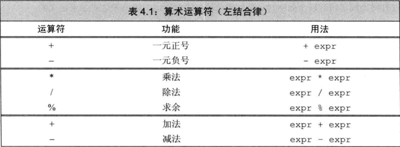
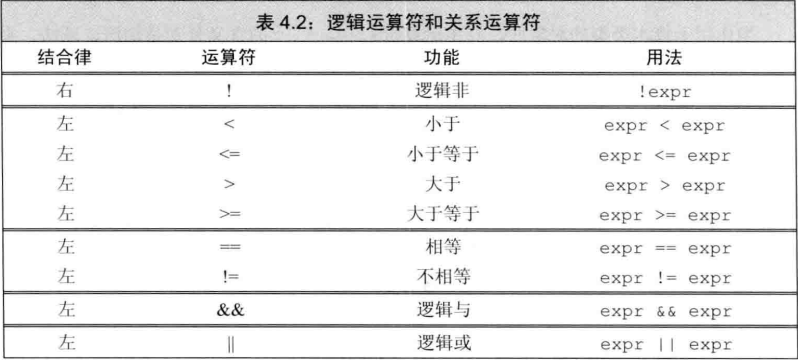
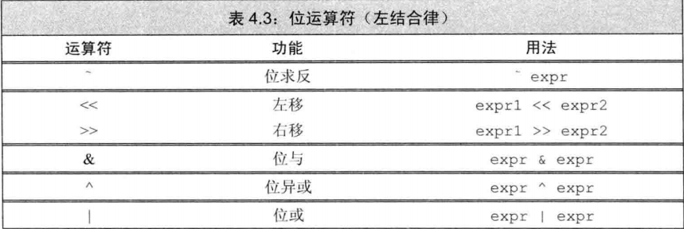
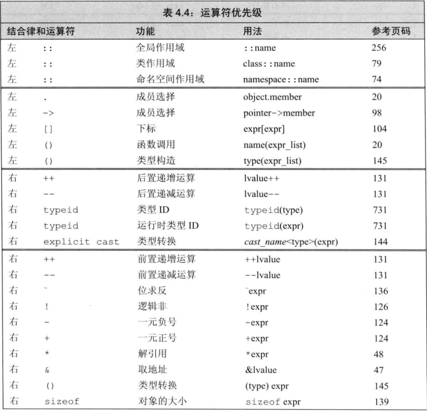
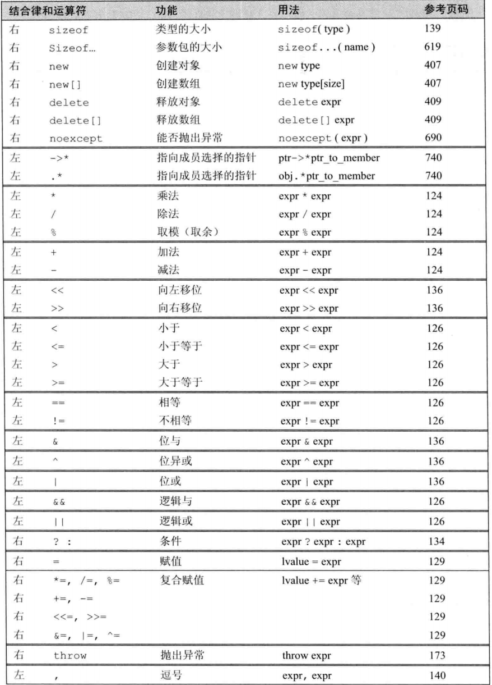

# 4.1 基础
* 表达式由一个或多个**运算对象**(operand)和一个或多个**运算符**(operator)组成, 对**表达式**(expression)求值会产生一个**结果**(result), 字面值和变量是最简单的表达式, 他们的值就是他们本身, 把一个**运算符**(operator)和一个或多个运算对象组合起来可以生成较复杂的表达式.
</br>
* C++定义了一元, 二元以及一个三元运算符, 函数调用也是一种特殊的运算符, 它对于运算对象的数量没有限制.
* 一些符号既能作为一元运算符也能作为二元运算符, 对于这类符号来说, 两种方法用法互不相干, 完全可以当成两个不同的符号.
</br>
* **左值和右值**
  * C++的表达式要不然是**左值**(lvalue), 要不然是**右值**(rvalue), 左值是指向某个对象的表达式, 右值是不指向任何对象的表达式.
  * 当一个对象被用作右值时, 用的是对象的值(内容), 当一个对象被用作左值时, 用的是对象的身份(在内存中的位置).

***

# 4.2 算术运算符

> 上表按优先级分组

* 除非另做特殊说明, 算数运算符都能作用于任意算术类型, 以及任意能转换成算术类型的类型.
* 算数运算符的运算对象和求值结果的类型都是运算对象的类型, 除非运算对象的类型不同, 这种情况下, 会**将运算对象转换成一致的类型再进行运算**.

* **溢出和其他算数运算异常**
  * 算数表达式可能产生未定义的结果, 如除数为0的情况, 也可能产生溢出, 如整数相加超过了最大值.
    > 对于溢出的情况, 结果是不可知的, 很多系统在编译和运行时都不报溢出错误, 但是在某些情况下, 会产生未定义的结果, 如会发生环绕的情况, 如int类型的最大值加1, 结果是最小值(符号位由于溢出改为了1).

* 在除法运算中, 如果两个运算对象的符号相同, 则商为正
* 除了`-m`导致溢出的特殊情况, 其他时候, `(-m) / n`和`m / (-n)`的结果都是`-(m / n)`, `(-m) % n`等于`-(m % n)`, `m % (-n)`的结果是`m % n`
  > 如果`m % n`不等于0, 则`m % n`和`m`的符号相同

***

# 4.3 逻辑和关系运算符

> 进行比较运算时, 除非比较的对象时布尔类型, 否则不要使用布尔字面值true和false作为运算对象

# 4.4 赋值运算符
* 赋值运算符的左侧运算对象必须是一个**可修改的左值**
  ```cpp
  // 初始化非赋值
  int i = 0, j = 0, k = 0;
  const int ci = i;

  // 下列赋值语句都是非法的
  1024 = k; // 1024是右值, **字面值是右值**
  i + j = k; // i + j是右值, **算数表达式是右值**
  ci = k; // ci是**常量(不可修改的)左值**
  ```

* 赋值运算的结果是它的左侧运算对象, 并且是一个左值.
* 赋值运算的结果类型就是左侧运算对象的类型.
* 如果赋值运算符的左右两个运算对象类型不同, 则**右侧运算对象会被转换成左侧运算对象的类型**.
* C++11允许使用初始化列表作为赋值语句的右侧对象.
  ```cpp
  k = 0; // 结果: 类型是int, 值是0
  k = 3.14; // 结果: 类型是int, 值是3
  k = {3.14}; // C++11, 错误: 窄化转换
  ```
  > **如果使用列表初始化且初始值存在丢失信息的风险, 则编译器将报错**.

* 对于类类型来说, 赋值运算的细节由类本身来决定(重载运算符)

# 4.5 递增和递减运算符
* 递增和递减运算符有前置和后置两种形式
  ```cpp
  int i = 0, j;
  j = i++; // j = 0, i = 1: 后置版本得到i的原始值, 然后递增i
  j = ++i; // j = 2, i = 2: 前置版本得到递增之后的值
  ```
* 递增和递减运算符必须作用于可修改的左值运算对象
  * **前置版本将对象本身作为左值返回**
  * **后置版本则将对象*原始值的副本*作为右值返回**
> 除非必须, 否则不用递增递减运算符的后置版本
> 在特殊情况, 可使用后置版本使代码变得简洁
> ```cpp
> auto pbeg = v.begin();
> while (pbeg != v.end() && *pbeg >= 0)
>   cout << *pbeg++ << endl; // 输出当前值, 并将迭代器递增
> ```
> `*pbeg++`等价于`*(pbeg++)`, 先使用`pbeg`的原始值, 然后递增`pbeg`
> 上述代码等价于
> ```cpp
> cout << *pbeg << endl;
> pbeg++;
> ```

# 4.6 成员访问运算符
* 点运算符获取类对象的一个成员, 表达式`ptr->mem`等价于`(*ptr).mem`
* 解引用运算符的优先级低于点运算符, 故`*p.m`等价于`*(p.m)`, 而不是`(*p).m`
* 箭头运算符作用于一个指针类型的运算对象, **结果是一个左值**
* 点运算符分成两种情况:
  1. 如果成员所属的对象是左值, 那么结果是左值
  2. 如果成员所属的对象是右值, 那么结果是右值

# 4.7 条件运算符
* 条件运算符的形式为`cond ? expr1 : expr2`, 其中`cond`是一个条件表达式, `expr1`和`expr2`是两个相同类型的表达式
* 条件运算符的优先级非常低, 因此在一条长表达式中使用条件运算符时, 应该使用括号来提高优先级
  ```cpp
  cout << ((grade < 60) ? "fail" : "pass");  // 输出pass或fail
  cout << (grade < 60) ? "fail" : "pass"; // 输出1或0
  cout << grade < 60 ? "fail" : "pass";  // 错误: 试图比较cout和60
  ```
  > 在第二个表达式中, `grade` 和 60 的比较结果是 `<<` 运算符的运算对象, 因此, 如果 `grade` 小于 60, 则输出 1, 否则输出 0. `<<`运算符的返回值是cout, 接下来cout作为条件运算符的条件, 也就是说, 第二条表达式等价于:
  > ```cpp
  > cout << (grade < 60); // 输出 1 或 0
  > cout ? "fail" : "pass"; // 根据cout的值产生对应的字面值
  > ```
  > 第三个表达式等价于:
  > ```cpp
  > cout << grade; // 输出 grade 的值
  > cout < 60 ? "fail" : "pass"; 
  > ```

# 4.8 位运算符
* 位运算符**只能作用于整型运算对象**, 并把运算对象看成是二进制位的集合

* 关于符号位如何处理, 与机器相关, 没有明确的规定, 故**建议仅将位运算符用于无符号类型**
* 移位运算符的优先级不高不低: 比算术运算符的优先级低, 比关系运算符, 赋值运算符和条件运算符的优先级高
* 重载运算符的优先级和结合律都与它的内置版本一样

# 4.9 sizeof运算符
* sizeof运算符返回一条表达式或一个类型名字所占的**字节数**
* sizeof运算符满足友结合律, 所得的值是一个`size_t`类型的**常量表达式**
* 运算符的形式为`sizeof(type)`或`sizeof expr`, 其中`type`是一个类型名, `expr`是一个表达式, 在第二种形式中, 返回的**表达式结果类型**的大小, 并不实际计算其运算对象的值.
* 可以通过`sizeof`计算得到整个数组的大小`sizeof arr / sizeof arr[0]`
* 因为`sizeof`运算符的结果是一个`size_t`类型的**常量表达式**, 因此可以使用`constexpr`和`const`来初始化一个`const`对象
  ```cpp
  constexpr size_t array_size = 10;
  int ia[array_size];
  ```

# 4.10 逗号运算符
* 逗号运算符含有两个运算对象, 从左到右计算这两个运算对象, 并**返回右侧运算对象的结果**, **将左侧的运算对象的值丢弃**, 经常用的for循环中的逗号运算符
  ```cpp
  for (int i = 0, j = sz; i != j; ++i, --j) // 从两端向中间遍历
  ```

# 4.11 类型转换
* 算数类型之间的隐式转换被设计得尽可能避免损失精读, 如果表达式中的运算对象的类型不一致, 则编译器会自动将**值较小的类型转换为值较大的类型**, 以便保证结果的类型不会丢失精度
* 在大多数表达式中, 比int类型更小的整型值会被提升为int类型, 比double类型更小的浮点类型会被提升为double类型
* 在条件中, 任何非0值都会被转换为1, 0值会被转换为0
* 初始化过程中, 初始值的类型会被转换为变量的类型
* 赋值语句中, 右侧运算对象的类型会被转换为左侧运算对象的类型
* 如果算数运算或关系运算的运算对象的类型不一致, 则编译器会将**值较小的类型转换为值较大的类型**, 以便保证结果的类型不会丢失精度
* 函数调用时也会发生类型转换

## 4.11.1 算数转换
* 算数转换是指将一个算数类型转换为另一个算数类型, 但是不改变其值
* 实例:
  ```cpp
  bool flag;
  short sval;
  int ival;
  long lval;
  float fval;
  double dval;
  char cval;
  unsigned short usval;
  unsigned int uival;
  unsigned long ulval;

  3.14L + 'a'; // 'a'的类型是char, 转换为int, 再转换为long double
  dval + ival; // ival的类型是int, 转换为double
  dval + fval; // fval的类型是float, 转换为double
  ival = dval; // dval的类型是double, (切除小数部分后)转换为int
  flag = dval; // 如果dval的值是0, 则flag的值为false, 否则为true
  cval + fval; // cval的类型是char, 转换为int, 再转换为float
  sval + cval; // sval和cval都转换为int
  cval + lval; // cval转换为long
  ival + ulval; // ival转换为unsigned long
  usval + ival; // 根据unsigned short和int的大小进行转换
  uival + lval; // 根据unsigned int和long的大小进行转换, 依赖于机器
  ```

## 4.11.3 显式转换
* 显式转换是指使用强制类型转换运算符将一个值转换为另一种类型
* 强制类型转换的格式:
  ```cpp
  type(expr)
  ```
  其中, type是要转换成的类型, expr是要转换的值, 如果type是引用类型, 则结果是一个左值
  `cast-name`是强制类型转换运算符的名字, 有四种:`static_cast`, `const_cast`, `dynamic_cast`, `reinterpret_cast`

</br>
* `static_cast`用于具有明确定义的不包含底层const的类型转换.
  ```cpp
  // 进行强制类型转换, 以便执行浮点数除法
  double slope = static_cast<double>(j) / i;
  ```

  * 把一个较大的算数类型, 赋给较小的类型时, 可以使用`static_cast`进行强制类型转换, 但是这样做会丢失一些信息
  * 可以转指针
  ```cpp
  void *p = &d;
  double *dp = static_cast<double*>(p);
  ```
</br>
* `const_cast`只能改变运算对象的底层const, 不能改变其他的const
  ```cpp
  const char *pc;
  char *p = const_cast<char*>(pc); // 从const char*转换为char*, 但通过p写值是未定义的行为
  ```

</br>
* `reinterpret_cast`通常为运算对象的位模式提供较低层次上的重新解释
  ```cpp
  int i = 42;
  void *p = &i;
  long *lp = reinterpret_cast<long*>(p); // 将int*转换为long*
  ```
> 通常, 我们不应该使用`reinterpret_cast`, 因为它会破坏类型系统, 使得程序更难理解和维护

* 老式的C语言风格的强制类型转换
  ```cpp
  int i = 3.14; // i的值是3
  int j = (int)3.14; // j的值是3
  ```

# 4.12 运算符优先级

