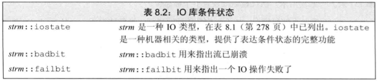
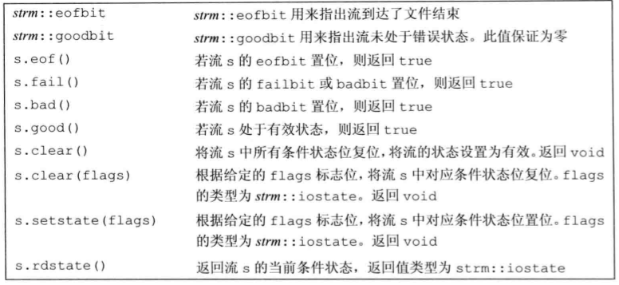
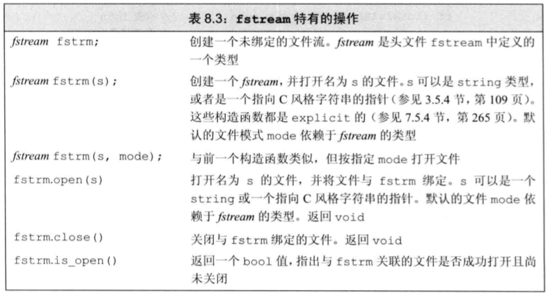
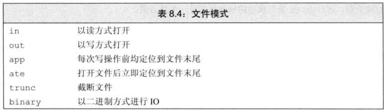
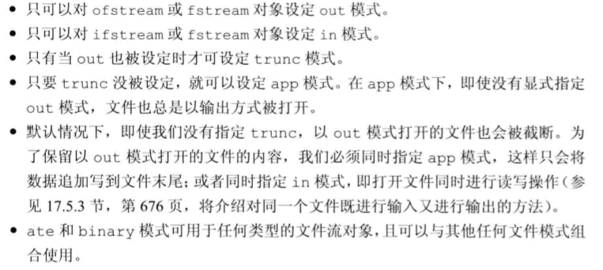
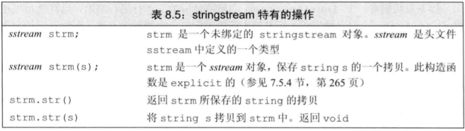

* C++语言不直接处理输入输出, 而是通过一族定义在标准库中的类型来处理IO. 这些类型支持从设备读取数据, 向设备写入数据的IO操作, 设备可以是文件, 控制台窗口等. 还有一些类型支持内存操作, 比如从string读取数据, 向string写入数据.
* 下列为部分IO库设施:
  * `istream`(输入流)类型, 提供了输入操作
  * `ostream`(输出流)类型, 提供了输出操作
  * `cin`, 一个istream对象, 从标准输入读取数据
  * `cout`, 一个ostream对象, 向标准输出写入数据
  * `cerr`, 一个ostream对象, 通常用于输出程序的错误消息, 写入到标准错误
  * `>>`运算符, 用来从一个istream对象读取输入数据
  * `<<`运算符, 用来向一个ostream对象写入输出数据
  * `getline`函数, 从一个istream对象读取一行数据, 存入一个string对象中

# 8.1 IO类

> 为了支持使用宽字符的语言, 标准库定义了一组类型和对象操纵`wchar_t`类型的数据. 如wcin, wcout, wcerr, wifstream.

* IO对象不能进行拷贝或赋值, 但是可以拷贝或赋值指向IO对象的指针或引用.
* 读写一个IO对象会改变其状态, 因此传递和返回的引用不能是const的.

## 8.1.2 条件状态
* 下表位IO类所定义的一些函数和标志, 可以帮助访问和操纵流的条件状态.
  
  

* 一个流一旦发生错误, 其上后续的IO操作都会失败. 确定一个流对象状态的最简单的方法是将它当做一个条件来使用. 如果流是有效的, 则条件为真, 否则为假.
    ```cpp
    while (cin >> word)
        cout << word << endl;
    ```
* 通常badbit被认为是流的致命错误, 一旦发生, 该流就不能再使用了. 通常, 当一个流发生了致命错误, 我们会调用`exit`函数终止程序.
* failbit和badbit都是流的错误状态, 但是badbit是致命错误, failbit不是. failbit表示流发生了一些错误, 但是流仍然是有效的, 可以继续使用. 例如, 从一个文件读取数据, 如果读取到文件尾, 则会发生failbit错误, 但是文件仍然是有效的, 可以继续读取.

## 8.1.3 管理输出缓冲
* 通常, 输出流会将数据缓存在一个内存区域中, 直到缓冲区满或者程序显式地刷新缓冲区. 刷新缓冲区的方法是调用`flush`函数, 或者向流插入一个换行符, 或者向流插入一个空格, 或者向流插入一个制表符.
* 导致缓冲刷新(即, 数据真正写到输出设备或文件)的原因:
  * 程序正常结束, 作为main函数的return操作的一部分, 缓冲刷新被执行
  * 缓冲区满时, 需要刷新缓冲, 而后新的数据才能继续写入缓冲区
  * 可以使用操纵符如endl显式刷新缓冲区
  * 在每个输出操作之后, 可以用操纵符unitbuf设置流的内部状态, 来情况缓冲区, 默认情况下, 对cerr是设置unitbuf的, 因此写到cerr的内容都是立即刷新的.
  * 一个输出流可能被关联到另一个流, 在这种情况下, 当读写被关联的流时, 关联到的流的缓冲区会被刷新. 
  * 刷新输出缓冲区: 
    * endl: 在输出缓冲区中插入一个换行符, 并且刷新缓冲区
    * ends: 在输出缓冲区中插入一个空字符, 并且刷新缓冲区
    * flush: 刷新缓冲区, 但是不在缓冲区中插入任何字符

* 如果想在每次输出操作后都刷新缓冲区, 可以使用`unitbuf`操纵符, 可以使接下来的每次写操作之后都进行一次flush操作. 而`onunitbuf`操作符则重置流, 例如:
    ```cpp
    cout << unitbuf; // 每次写操作之后都进行一次flush操作
    cout << nounitbuf; // 恢复正常的缓冲刷新操作
    ```
* **如果程序异常终止, 输出缓冲区不会被刷新, 因此, 有可能会丢失一些数据.**

* 当一个输入流被关联到一个输出流时, 读写被关联的流时, 关联到的流的缓冲区会被刷新.

***

# 8.2 文件输入输出
* 文件输入输出是指将数据从文件读入内存, 或者将数据从内存写入文件. 文件输入输出是通过`fstream`类型来完成的, `fstream`类型是`iostream`类型的子类, 因此, `fstream`类型对象既可以用来读取数据, 也可以用来写入数据. `ifstream`和`ofstream`分别用来读取数据和写入数据.
* 上述类型的操作与cin和cout类似, 但是, 它们的操作对象是文件而不是标准输入输出. 可以使用IO运算符(<<和>>)来读写文件, 也可以使用getline函数来读取一行数据.
  

* 为了使用文件输入输出, 需要包含头文件`<fstream>`, 并且使用`ifstream`或`ofstream`类型的对象来表示输入流或输出流. 例如:
    ```cpp
    ifstream in(ifile); // 用于读取文件的输入流
    ofstream out; // 用于写入文件的输出流
    ```
    > ifile可以为string类型, 也可以是C风格字符串.

* 当一个`fstream`对象离开其作用域时, 与之关联的文件会自动关闭. 即: 当一个`fstream`对象被销毁时, close会自动被调用.

## 8.2.2 文件模式
* 每个流都有一个关联的文件模式, 用来指出如何使用文件
  
  
* 指定文件模式有相应的限制:
  

* 默认情况下, 当打开一个ofstream时, 文件的内容会被丢弃, 组织一个ofstream清空文件的方法是指定`app`模式, 例如:
    ```cpp
    ofstream out("file", ofstream::app); // 以追加模式打开文件
    ```

***

# 8.3 string流

* `sstream`头文件定义了三个类型: `istringstream`和`ostringstream`以及`stringstream`. 这三个类型都是`istream`和`ostream`的子类, 因此, 可以使用IO运算符来读写这些类型的对象. 例如:
    ```cpp
    istringstream record("some string"); // 从string读取数据
    ostringstream msg; // 向string写入数据
    ```

