* **顺序容器**提供了控制元素存储和访问顺序的能力, **这种顺序不依赖与元素的值**, 而是与元素加入容器时的位置相对应.

# 9.1 顺序容器概述
* 各种容器在两方面都有不同的性能折中:
  1. 向容器添加或从容器中删除元素的代价
  2. 非顺序访问容器中元素的代价

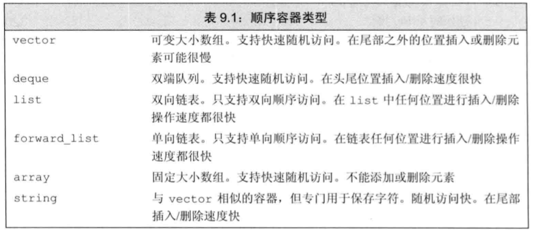

* `forward_list`和`array`是新标准库中的两种容器, 它们与其他容器有着不同的特性, 但是它们都是顺序容器.
* `array`是固定大小的数组, 其中的元素是值而不是对象, 不能添加或删除元素.
</br>
* **确定使用哪种顺序容器:**
  * 除非有特殊的理由, 否则应该使用`vector`.
  * 如果程序中有很多小元素, 且空间的额外开销很重要, 则不要使用`list`或`forward_list`.
  * 如果程序中要求随机访问元素, 应使用`vector`或`deque`.
  * 如果程序要求在容器的中间位置插入元素, 应使用`list`或`forward_list`.
  * 如果程序需要在头尾位置插入或删除元素, 但不会在中间位置进行插入或删除操作, 应使用`deque`.
  * 如果程序只有的读取输入时才需要在容器中间位置插入元素, 随后需要随机访问元素, 则:
    * 首先确定是否真的需要在容器中间位置添加元素. 当处理输入数据时, 通常很容易地想vector追加数据, 然后再调用标准库的`sort`函数来重排容器中的元素, 从而避免在中间位置添加元素.
    * 如果必须在中间位置插入元素, 考虑在输入阶段使用list, 一旦输入完成, 再将list中的内容拷贝到一个vector中.
  
  > 如果不确定应该使用哪种容器, 那么可以在程序中只使用`vector`和`list`公共的操作: 使用迭代器, 不适用下标操作, 避免随机访问. 

***

# 9.2 容器库概览
* 容器均定义为模板类, 需要指定容器保存的元素类型.
  ```cpp
  vector<string> svec; // svec保存string对象
  list<list<string>> file; // file保存的是string的list
  deque<map<string, vector<int>>> imap; // imap保存的是map的deque
  ```
  > 较旧的编译器需要在两个尖括号之间键入空格, 如`list<list<string> > file;`, 否则编译器会将`>>`解释为右移运算符.

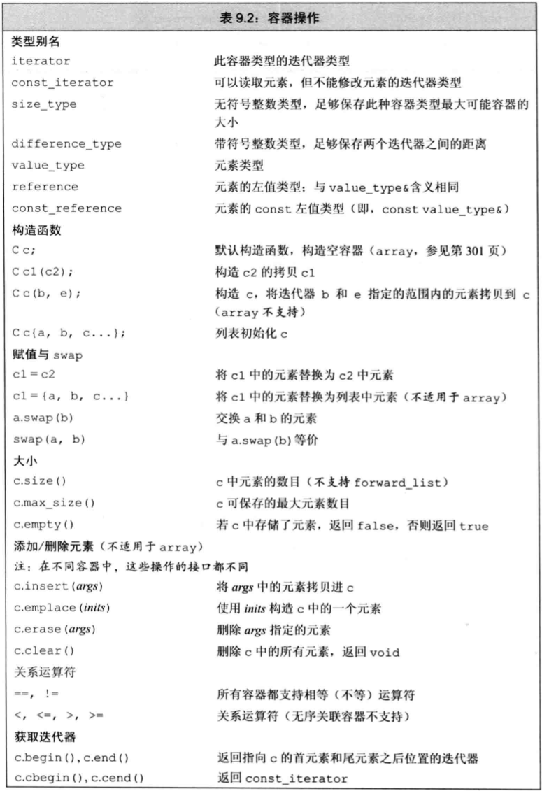
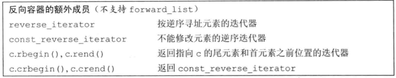

## 9.2.1 迭代器
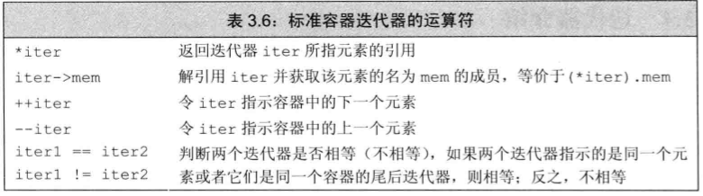
* 迭代器范围由一对迭代器表示, 两个迭代器分别指向同一个容器中的元素或者是容器尾后位置.
* 元素范围: [begin, end)
* `difference_type`是迭代器之间的距离类型.

## 9.2.2 begin和end成员
* `begin`和`end`成员函数返回指向容器中第一个元素和尾后位置的迭代器.
* `cbegin`和`cend`成员函数返回指向容器中第一个元素和尾后位置的常量迭代器.
* `rbegin`和`rend`成员函数返回指向容器中最后一个元素和头前位置的迭代器.

## 9.2.4 容器定义和初始化
* 除array之外, 其他的容器的默认构造函数都会创建一个指定类型的空容器, 且都可以接收指定容器大小和元素初始化值的参数.
  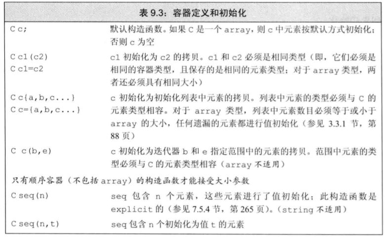

* 将一个新容器创建为另一个容器容器的拷贝的方法有两种: 可以直接拷贝整个容器, 或者(array除外)拷贝由一个迭代器对指定的元素范围.(范围不包括尾后位置)

* 定义`array`:
  ```cpp
  array<int, 10> a1; // 10个值为0的元素
  array<int, 10> a2 = {0, 1, 2, 3, 4, 5, 6, 7, 8, 9}; // 列表初始化
  array<string, 10> a3; // 10个空string
  array<int, 10>::size_type i; // i的类型是array<int, 10>::size_type
  array<int>::size_type j; // 错误: array<int>::size_type未定义
  ```
  > 数组的大小是array类型的一部分

* 不同于内置数组, array可以拷贝和赋值, 且可以使用标准库算法. 要求类型相同, 大小相同, 因为大小是array类型的一部分.
  ```cpp
  int digs[10] = {0, 1, 2, 3, 4, 5, 6, 7, 8, 9};
  int cpy[10] = digs; // 错误: 数组不能拷贝
  array<int, 10> digits = {0, 1, 2, 3, 4, 5, 6, 7, 8, 9};
  array<int, 10> cpy = digits; // 正确: array可以拷贝
  ```
  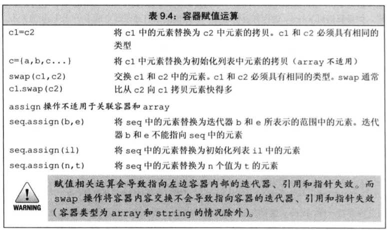

* `assign`允许使用一个不同但相容的类型赋值.
  ```cpp
  vector<const char*> oldstyle;
  vector<string> newstyle;
  newstyle = oldstyle; // 错误: 类型不同
  newstyle.assign(oldstyle.cbegin(), oldstyle.cend()); // 正确: 类型相容
  ```
  > `assign`接受一个迭代器对, 用来指定要拷贝的元素范围.

* `swap`用于交换两个相同类型的容器.
  ```cpp
  vector<string> svec1, svec2;
  swap(svec1, svec2); // 交换svec1和svec2的元素
  ```
  > `swap`不会拷贝元素, 只是交换两个容器的底层实现. 除array外, swap的时间复杂度是常数.

* 对一个string调用swap会导致迭代器, 引用和指针失效.
* 与其他容器不同, swap两个array会真正交换他们的元素, 因此, 交换两个array所需的时间与array中的元素的数目成正比.
* **对于array, 在swap之后, 指针, 引用和迭代器所绑定的元素保持主编, 但元素值已经与另一个array中对应的元素的值进行了交换.**

## 9.2.6 容器大小操作
* `empty`返回一个bool值, 表示容器是否为空.
* `size`返回一个`size_type`值, 表示容器中的元素数目.
* `max_size`返回一个`size_type`值, 表示容器能容纳的最大元素数目.(`forward_list`不支持`max_size`和`empty`).

## 9.2.7 关系运算符
* 每个容器类型都支持`==`和`!=`运算符, 用于比较两个容器是否相等.
* 除了无序关联容器外的所有容器都支持关系运算符`<`, `<=`, `>`, `>=`.
* 关系运算符要求运算对象的类型相同.
  ```cpp
  vector<int> ivec1 = {1, 3, 5, 7, 9, 12};
  vector<int> ivec2 = {1, 3, 9};
  vector<int> ivec3 = {1, 3, 5, 7};
  vector<int> ivec4 = {1, 3, 5, 7, 9, 12};
  ivec1 < ivec2; // true, ivec1[2] > ivec2[2]
  ivec1 < ivec3; // false, ivec3元素数目更少
  ivec1 == ivec4; // true, ivec1和ivec4的元素相同, 且数量相同
  ivec1 == ivec2; // false, ivec1和ivec2的元素相同, 但数量不同
  ```
  > 关系运算符要求容器的元素类型支持关系运算符. 自定义类型如果没有定义关系运算符, 则不能用于关系运算符.

***

# 9.3 顺序容器操作
## 9.3.1 向顺序容器添加元素
* 除`array`外, 所有标准库容器都提供灵活的内存管理. 在运行时, 可以向容器添加元素, 并且可以删除已有元素.
  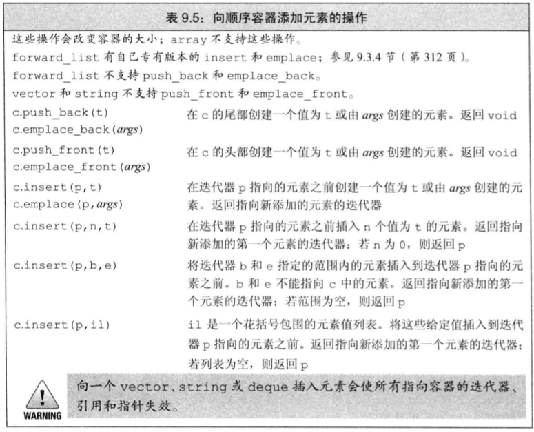

* 除array和forward_list之外, 每个顺序容器都支持`push_back`.
* 当使用一个对象来初始化容器时, 或将一个对象插入到容器中时, 实际上放入到容器中的是对象的一个拷贝, 而不是对象本身.
* `list`, `forward_list`和`deque`容器支持`push_front`操作, 将元素添加到容器的头部.
* vector, deque, list和string都支持`insert`成员, 可以在容器中的任意位置插入元素.
  ```cpp
  vector<int> ivec = {0, 1, 2, 3, 4, 5, 6, 7, 8, 9};
  auto iter = ivec.begin();
  while (iter != ivec.end()) {
    if (*iter % 2) {
      iter = ivec.insert(iter, *iter);
      iter += 2;
    } else {
      iter = ivec.erase(iter);
    }
  }
  ```
  > `insert`返回一个指向新添加元素的迭代器. `erase`返回一个指向删除元素之后的元素的迭代器.
  > 将元素插入到vector, deque和string中的任何位置都是合法的, 然而这种操作可能很耗时.

* `insert`还可以接受多个参数, 用于在容器中插入多个元素.
  ```cpp
  vector<int> ivec = {0, 1, 2, 3, 4, 5, 6, 7, 8, 9};
  ivce.insert(ivec.begin(), 10, 42);
  ivce.insert(ivec.end(), {1, 2, 3, 4, 5});
  ```
  > 如果传递给insert一对迭代器, 它们不能指向添加元素的目标容器.

* 在新标准中, 引入了`emplace_front`, `emplace`和`emplace_bace`成员, 用于在容器中构造元素, 而不是拷贝, 这三个字成员分别对应push_front, insert和push_back.
  ```cpp
  vector<string> svec;
  svec.reserve(1024);
  string word;
  while (cin >> word) {
    svec.push_back(word);
    svec.emplace_back(word);
  }
  ```
  > `emplace_back`和`push_back`的效果相同, 但是`emplace_back`不需要拷贝word, 而是直接在容器中构造word.
  > **emplace函数在容器中直接构造元素**, 传递给emplace的参数将直接传递给元素类型的构造函数.

### 9.3.2 访问元素
* 如果容器中没有元素, 访问操作的结果是未定义的.
* 包括array在内的每个顺序容器都有一个`front`成员, 返回容器中的第一个元素的引用.
* 除`forward_list`外, 每个顺序容器都有一个`back`成员, 返回容器中的最后一个元素的引用.
  ```cpp
  // 在解引用一个迭代器或调用front或back之前, 应该检查容器是否为空.
  if (!svec.empty()) {
    // va1和va2是svec中第一个元素值的拷贝
    auto va1 = svec.front();
    auto va2 = *svec.begin();

    // va3是svec中最后一个元素的值的拷贝
    auto last = svec.end();
    auto va3 = *(--last);
    auto va4 = svec.back(); // forward_list没有back成员
  }
  ```
  > 在调用front和back之前, 需要确定容器非空, 不然会产生未定义的行为

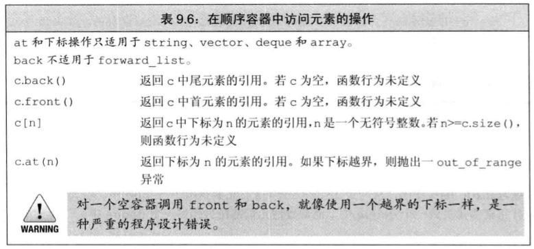

* 使用容器的成员函数返回的都是引用, 可以通过返回的引用修改元素值(const的引用除外). `auto &val = svec.front();` val是svec中第一个元素的引用, 可以通过val修改svec中的元素值.
  > 注意需要添加取引用符

* 可快速随机访问的容器(string, vector, deque, array)支持下标运算符. 下标的使用必须在指定的范围内.(**大于等于0, 小于容器的大小, 且不为空**)

## 9.3.3 删除元素
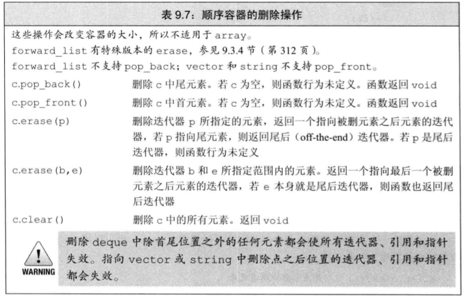
> 在删除元素之前, 必须确保它们是存在的. 

* `forward_list`是单向链表, 只能从前向后遍历, 不能像其他容器一样, 从后向前遍历. 因此, `forward_list`没有`pop_back`成员.
  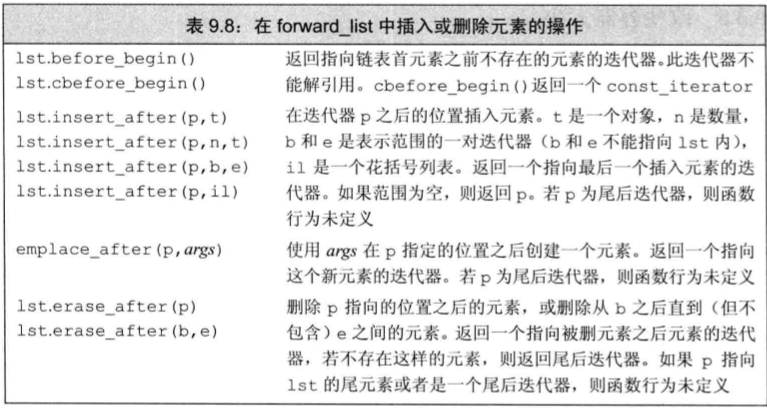

* 通过`resize`来增大或缩小容器(array不支持)
  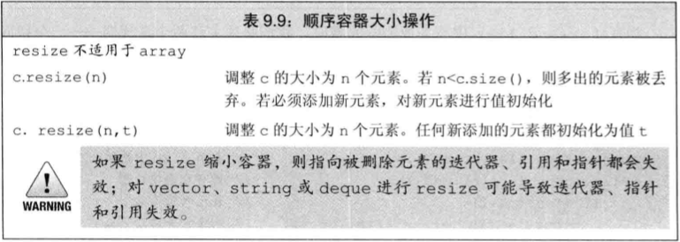

## 9.3.6 容器操作可能使迭代器失效
* **在向容器添加元素后:**
  * 如果容器是`vector`或`string`, 且存储空间被重新分配, 则指向容器的迭代器和引用都会失效. 如果存储空间未被重新分配, 则指向插入位置之前的元素的迭代器和引用都不会失效. 但指向插入位置之后的元素的迭代器和引用都会失效.
  * 对于deque, 插入到除首尾位置之外的任何位置都会导致迭代器, 指针和引用失效, 如果在首尾位置添加元素, 迭代器会失效, 但指向存在的元素的引用和指针不会失效.
  * 对于list和forward_list, 指向容器的迭代器(包括尾后迭代器和首前迭代器), 指针和引用仍然有效.

* **当删除一个元素后:**
  * 对于list和forward_list, 指向容器其他位置的迭代器(包括尾后迭代器和首前迭代器), 指针和引用仍然有效.
  * 对于deque, 如果在首尾之外的任何位置删除元素, 那么指向被删除元素外其他元素的迭代器, 引用或指针也会失效. 如果是删除deque的尾元素, 则尾后迭代器也会失效, 但其他迭代器, 引用和指针不受影响; 如果是删除首元素, 这些也不会受影响.
  * 对于vector和string, 指向被删元素之前元素的迭代器, 引用和指针仍然有效.
  > 当删除元素时, 尾后迭代器总是会失效.
  > 使用失效的迭代器, 指针或引用是严重的运行时错误.

> 在使用迭代器(或指向容器元素的引用或指针)时, 最小化要求迭代器必须保持有效的代码块的大小. 一旦迭代器失效, 就不要再使用它.

* 不要保存end返回的迭代器

***

# 9.4 vector对象是如何增长的
* 为了支持快速随机访问, vector将元素连续存储, 在添加新元素的的时候, 需要重新分配内存空间, 并将原来的元素拷贝到新的空间中, 这样执行内存分配和释放的操作, 会导致vector的性能下降.
* 当我们向一个vector对象添加元素时, 如果vector对象的大小超过了当前的容量, vector对象就会重新分配更大的内存空间, 然后将原来的元素拷贝到新的空间中. 这个过程称为**容器的重新分配**.
  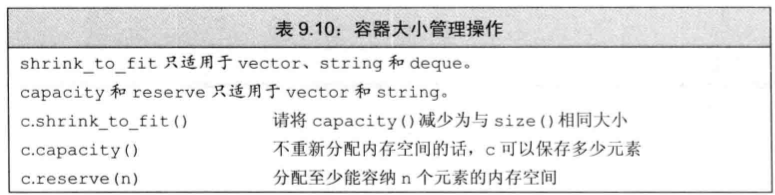
  > reserve并不改变容器中元素的数量, 它仅影响vector预先分配多大的内存空间.
  > reserve只是预先分配内存空间, 并不会真正的创建元素, 因此, reserve不会导致迭代器失效.

* 调用`shrink_to_fit`只是一个请求, 标准库并不保证退还内存.
* 只有在执行insert操作时, size与capacity相等时, 才会重新分配内存空间.

***

# 9.5 额外的string操作
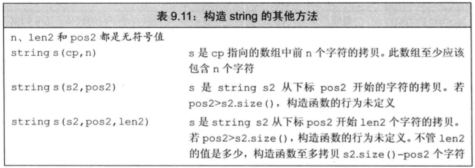
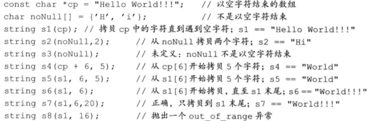

* `substr`返回一个string对象, 它是原string对象的一个子串.
  ```cpp
  string s("some string");
  string s2 = s.substr(); // s2 == "some string"
  string s3 = s.substr(5); // s3 == "string"
  string s4 = s.substr(5, 3); // s4 == "str"
  string s5 = s.substr(12);   // out_of_range异常
  ```

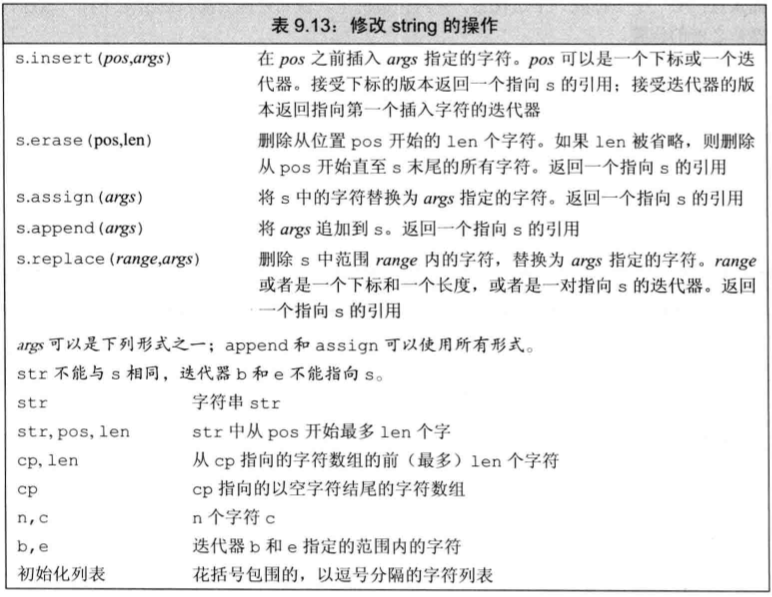
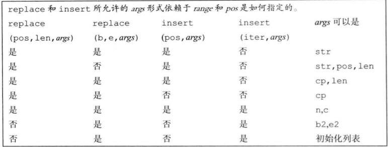

## 9.5.3 string搜索操作
* string对象提供了六个不同的搜索函数, 每个函数都有4个重载版本.
* 每个搜索操作返回一个`string::size_type`值, 表示搜索到的字符在string对象中的位置.
  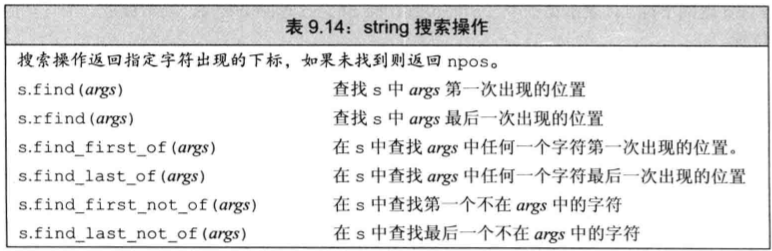
  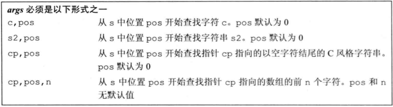
  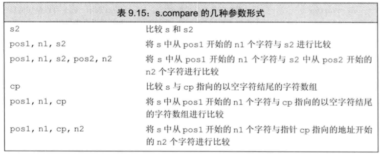
  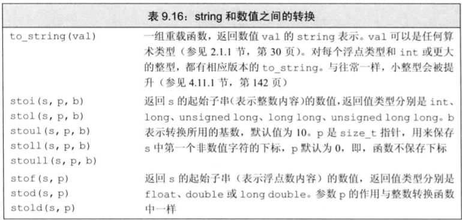

***

# 9.6 容器适配器
* 容器适配器是一种特殊的容器, 它们不提供直接的访问元素的方法, 它们的功能是限制容器的用途.
  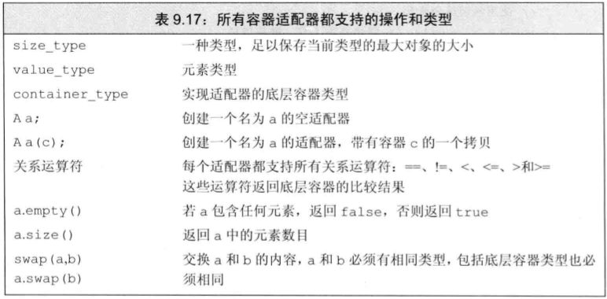
  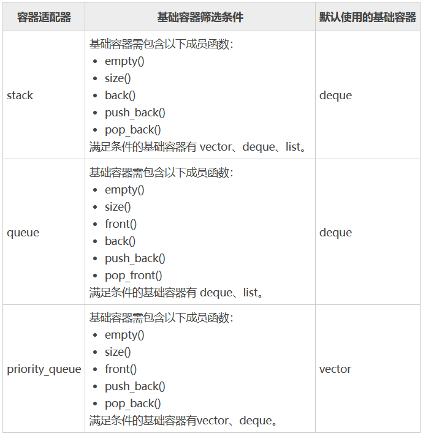


# 引用及推荐:
[deque相关](https://blog.csdn.net/FX677588/article/details/76222608)
[容器适配器详解](http://c.biancheng.net/view/6967.html)
